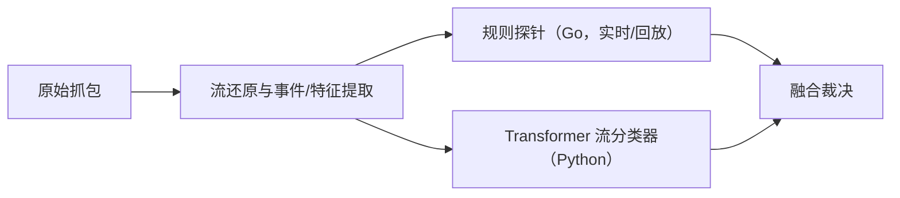
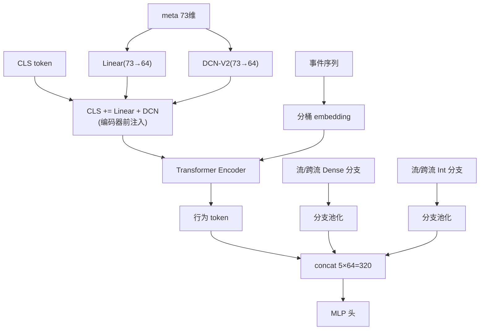

# 基于密文侧信道事件序列与多分支直读架构的加密恶意流量检测

**Detecting Encrypted Malicious Traffic via Ciphertext-Side-Channel Event Sequences and Multi-Branch Direct-Read Architectures**

**作者：** （作者占位）

**单位：** （单位占位）

**日期：** 2026-08-14

---

## 摘要

加密恶意流量（WebShell、C2、隧道、RAT 等）与正常流量在可观测层面高度重叠，传统基于
CICFlowMeter 式流级聚合统计的方法丢失了包序列结构与跨流行为信息，导致误报与漏报难以
两全。本文提出一套“规则探针 + Transformer 流分类器”双通道检测框架，并围绕
“强判别特征必须直读”这一核心发现设计了一系列架构。方法层面：将原始抓包转换为
密文侧信道事件序列（方向/载荷大小/到达间隔的分桶 token）与五类流级特征（流/跨流 ×
稠密/离散，共 73 维）；架构层面，系统对比了 flat 单投影、grouped 分组 token、
multicol 多列、DCN-V2 交叉、flat 双通路（dual）、五分支直读（five）及其混合架构
（DualFive）。在包含 59 种恶意工具、69 个来源与多段真实流量的数据集（13,909 条流）
上，采用随机分割、工具级 5 折、真实流量整段留出三种协议评估。实验表明：①基于
聚合统计的特征（39/76 维纯 CIC）无法泛化到服务器侧流量（误报 4%-8%）；②任何形式
的 meta 特征经注意力“绕行”都会使未见工具召回从 0.99 塌缩至 0.44，而线性直读
路径（dual 的 CLS 直连）是泛化的关键；③最终架构 DualFive73-Pre 在三个未见真实流量
包上实现零误报，A 测试集召回 0.9951（AUROC 1.0000），未见工具召回 0.9943
（AUROC 0.9996），并在 suo5/deimos/gost 等工具上取得最优或并列最优表现。

**关键词**：恶意流量检测；加密流量；Transformer；密文侧信道；特征直读；跨流特征；
未见工具泛化

## Abstract

Encrypted malicious traffic (WebShells, C2, tunneling, RATs) heavily overlaps with
benign traffic at the observable level. Conventional CICFlowMeter-style flow-level
aggregate statistics discard packet-sequence structure and cross-flow behavior,
making it hard to balance false positives and misses. This paper proposes a
dual-channel framework combining a rule-based probe and a Transformer flow
classifier, and designs a family of architectures around the key finding that
strongly discriminative features must be read directly rather than routed through
attention. We encode raw captures into ciphertext-side-channel event sequences
(bucketed direction / payload-size / inter-arrival tokens) plus five groups of
flow-level features (flow/cross-flow × dense/discrete, 73 dimensions in total).
Architectures compared include flat single projection, grouped tokens, multicol
views, DCN-V2 crossing, flat dual-path (dual), five-branch direct read (five),
and their hybrid (DualFive). On a dataset of 13,909 flows covering 59 malicious
tools, 69 sources, and multiple real-traffic segments, we evaluate under random
split, tool-level 5-fold cross-validation, and leave-one-pcap-out protocols.
Results show: (1) aggregate-statistics features (39/76-dim pure CIC) fail to
generalize to server-side traffic (FPR 4%–8%); (2) routing meta features through
attention collapses unseen-tool recall from 0.99 to 0.44, whereas direct linear
read paths (dual CLS injection) are essential for generalization; (3) the final
DualFive73-Pre architecture achieves zero false positives on three unseen
real-traffic captures, A-test recall 0.9951 (AUROC 1.0000), unseen-tool recall
0.9943 (AUROC 0.9996), and best-or-tied per-tool results on suo5/deimos/gost.

**Keywords**: malicious traffic detection; encrypted traffic; Transformer;
ciphertext side channel; direct feature read; cross-flow features; unseen-tool
generalization

---

## 1. 引言

恶意软件通过加密通信（WebShell 交互、C2 信标、隐蔽隧道、RAT 会话等）将攻击行为伪装
成正常网络活动，使恶意与正常流量在可观测层面高度重叠。传统检测方案主要依赖
CICFlowMeter 式流级聚合统计（包长均值/方差、到达间隔统计、标志位计数等）构建特征，
再训练浅层分类器。这类方法存在三个固有缺陷：(i) 丢失包序列与结构信息——例如“连续
多个大块请求后再响应”与“一问一答交替”可以产生几乎相同的聚合统计值，但恰恰是这种
时序结构区分着 WebShell 与正常浏览；(ii) 丢失跨流行为信息——爆破、端口扫描等
“同一来源在短窗口内发起大量连接”的信号在单流聚合中根本不存在；(iii) 难以对齐
加密长连接、心跳型与 UDP 工具的固定流窗口，导致特征空间混叠严重。

针对上述问题，本文从密文侧信道角度重新设计数据链路：不解密内容，仅利用数据包的方向、
载荷大小与到达间隔构造事件序列，并结合 TLS 结构、连接完成率、HTTP 浅层语义与多尺度
跨流统计构建流级特征。检测端采用“规则探针 + Transformer 流分类器”双通道：规则探针
保证已知模式的高精度与可解释性，Transformer 模型负责从未见流量中泛化恶意信号。

本文的主要贡献如下：

1. 构建了一个包含 59 种恶意工具（69 个来源）、17 类合成正常流量与多段真实流量
   （本机桌面与远程服务器侧）的加密流量检测数据集，并给出规范的采集与评估协议
   （随机分割、工具级 5 折、真实流量整段留出）；
2. 提出密文侧信道事件序列编码与五类流级特征体系，并系统验证“特征类型优于特征数量”
   ——完整 CICFlowMeter 式 76 维聚合特征并不优于 39 维，而针对失败模式设计的
   HTTP 浅层与多尺度跨流特征（73 维）带来显著增益；
3. 通过大规模架构消融，揭示并解释了一个关键现象：**强判别特征必须直读，任何经
   注意力“绕行”的注入都会破坏未见工具泛化**；据此提出 flat 双通路（dual）、
   五分支直读（five）及其混合架构 DualFive，最终模型在三个未见真实流量包上实现
   零误报，未见工具召回 0.9943（AUROC 0.9996）。

## 2. 相关工作

### 2.1 网络流量特征与检测

CICFlowMeter 提取的流级统计特征（Lashkari et al., 2017）是入侵检测数据集
（如 CICIDS2017）的标准输入，配合随机森林、SVM 等浅层模型。此类特征对时序结构
不敏感，且无法表达跨流行为，已在诸多研究中被证明对加密/隐蔽流量效果有限。

### 2.2 深度学习与 Transformer

Transformer（Vaswani et al., 2017）及其自注意力机制在序列建模中占据主导；BERT
（Devlin et al., 2019）与 ViT（Dosovitskiy et al., 2021）引入的 CLS 分类读出
token 成为序列级表示的标准做法。残差连接（He et al., 2016）保证深层网络中信息与
梯度的直通，本文 dual 架构的“CLS 直连注入”即基于同一思想。针对表格数据的
FT-Transformer（Gorishniy et al., 2021）将每个特征维度 token 化并送入注意力，
本文的 GroupNSTokenizer 借鉴了“逐特征 embedding”的思想，但实验表明其必须与
直读路径配合。

### 2.3 特征交叉与 Click-Through 模型

Deep & Cross Network（Wang et al., 2017）及其改进 DCN-V2（Wang et al., 2021）
以低秩交叉层显式建模特征交互，本文将其作为稠密特征组的 token 生成器，并发现
小维度分组上的 DCN 交叉是工具级判别的重要来源。

### 2.4 加密流量指纹

JA3（Althouse et al., 2017）等 TLS 客户端指纹常用于规则侧识别；本文在规则探针中
使用 JA3 信号，并在 ML 特征实验中验证了将 JA3 直接作为特征的过拟合风险（详见
7.4 节消融）。

## 3. 问题定义与总体框架

### 3.1 问题定义

给定一条网络流（按五元组与 TCP 方向聚合），目标是二分类：恶意（1）或正常（0）。
每条流由原始抓包还原为：事件序列 $S=\{e_1,\dots,e_L\}$（$L\le 96$）与流级特征
向量 $m\in\mathbb{R}^d$。模型 $f(S,m)\to[0,1]$ 输出恶意概率。

### 3.2 总体框架

框架包含两条并行通道：

**图 1** 双通道检测框架



规则通道基于密文侧信道规则（TLS 记录结构、时序节奏、JA3、HTTP 语义等）输出高精度
告警；ML 通道输出逐流恶意概率。两通道共用同一特征管线，可独立或融合部署。

## 4. 数据与特征工程

### 4.1 数据采集

**恶意流量**：覆盖 59 种恶意工具（69 个来源），其中 11 种为真实工具/协议复刻、
48 种为协议驱动仿真（beacon profile 支持 http / tcp_stream / udp / burst /
multiphase / keep-alive 六种形态）。另含爆破/扫描数据：SSH 爆破 900 条流、HTTP
爆破 900 条流、SYN 扫描 3,000 条流。

**正常流量**：17 类合成正常场景（约 5,400 条流），刻意包含“良性但像信标”的形态
（聊天轮询 8-15s、IoT 遥测 20-30s、SSH 保活、监控健康检查、合规爬虫、浏览器并发、
DNS 风暴等）；以及 6 段真实流量（本机桌面 5 段 1,471+929 条流，远程服务器 1 段
621 条流，共 3,021 条流）。

训练数据集共 13,909 条流（恶意 5,484 / 正常 8,425）。另采集第 7 段远程服务器流量
（196 条流）作为整段留出测试。

### 4.2 事件序列编码

每条流提取有载荷事件 $(\text{direction}, \text{size}, \Delta t)$，按时间排序，最多
96 个事件；无载荷连接保留零数据标记。三类离散化后查表并求和得到 token：

| 维度 | 分桶 | 规则 |
|---|---|---|
**表 1** 事件序列三类离散化

| 维度 | 分桶 | 规则 |
|---|---|---|
| 方向 | 2 | 客户端→服务端 / 反向 |
| 载荷大小 | 32 | $\lfloor\log_2 \text{size}\rfloor$，截断至 31 |
| 到达间隔 | 12 | 非均匀阈值 [1ms, 5ms, 20ms, 0.1s, 0.5s, 1s, 2s, 5s, 10s, 30s, 60s] |

token 向量（式 (1)）：

$$\text{token}=\text{Emb}_{\text{dir}}+\text{Emb}_{\text{sz}}+\text{Emb}_{\text{dt}}$$

各 embedding 均为 64 维；前缀 CLS token 后送入 Transformer Encoder（2 层、4 头、
FF 128），取 CLS 输出作为行为表示。

### 4.3 流级特征（73 维）

**表 2** 流级特征体系（73 维）

| 类别 | 维度 | 内容 |
|---|---:|---|
| 行为特征 | 16 | TLS/SNI/TLS1.3、时长、上下行字节、事件数、端口、TLS 记录结构、连接完成与否、跨流突发/扫描/多目的 |
| CIC 聚合 | 39 | 包数/字节、双向包长 min/max/mean/std、IAT 统计、标志位计数、方向比、活跃/空闲统计 |
| HTTP 浅层 | 7 | 是否 HTTP、GET/POST、请求行长度、头数量、keep-alive、响应码类别 |
| 多尺度跨流 | 11 | 1s/5s/60s 窗口的 burst/sweep/distinct-dsts 与源级聚合 |

所有数值特征经 $\log(1+x)$ 或 min-max 归一化。此外实现了 CICFlowMeter 式完整 76 维
聚合特征作为对照。

### 4.4 特征实验结论

在相同协议下比较纯 CIC（39 维）、完整 CIC（76 维）、base-55 与 base-73：纯 CIC
在三个未见真实流量包上误报 4.08%-8.45%，且 76 维并不优于 39 维；base-73 将误报
降至 0%-2.51%。**特征类型优于特征数量**，针对失败模式设计的 HTTP 浅层与多尺度
跨流特征是关键。

## 5. 检测方法

### 5.1 规则探针通道

Go 探针在 Linux 上通过 AF_PACKET 实时抓包，其他平台支持 pcap 回放；流重建、TLS
记录解析与 JA3 计算后按规则注册表输出 JSON 告警。经过对真实流量的 48 条误报逐条
收紧（natpass 加 Protobuf 签名、gost 要求 WebSocket 升级头、suo5 限定 TLS 与小
服务端首包等），规则通道在 61 个场景（59 正样本 + normal 负样本）上全绿，真实流量
误报降为 0。

### 5.2 Transformer 流分类器：架构演进

基线 `FlowTransformer` 将 55 维 meta 通过不同方式注入 Transformer 的 CLS token：

**表 3** FlowTransformer 架构变体与 meta 注入方式

| 变体 | meta 注入方式 |
|---|---|
| flat | 单 Linear 投影直连 CLS |
| grouped | 按语义分组为独立 token 前置到序列 |
| multicol | H=4 个独立投影取平均 |
| flat 双通路（dual） | Linear 直连 + DCN-V2 并行，均加至 CLS |
| five | 五类特征各生成 token 后按分支池化直读 |
| DualFive | five 分支 + dual 的 meta 前置注入 CLS |

**five 五分支**：流 Dense（7 个 DCN-V2 组）、跨流 Dense（3 组）、流 Int 与跨流 Int
（GroupNSTokenizer，逐特征 embedding 表 + 组内求和）、事件序列（UserBehavior），共
15 个 64 维 token；按分支池化后拼接（5×64=320）经 MLP 头分类。

**DualFive73-Pre**：在 five 基础上将 `Linear(73→64)+DCN(73→64)` 注入 CLS，且注入
发生在编码器**之前**（pre）。实验表明注入时机至关重要：编码器之后注入会使真实流量
误报升至 9.3%。

**图 2** DualFive73-Pre 架构



## 6. 实验设置

### 6.1 评估协议

- **A 随机分割**：流级 70/15/15（seed 42），衡量同分布性能；
- **B 工具级 5 折**：按工具整组留出，每个工具作为“未见”测试一次，逐折 Youden 调阈值，
  衡量未见工具泛化；
- **C 爆破/扫描专项**：跨模式未见 SYN 扫描 / SSH 爆破 / HTTP 爆破；
- **真实流量整段留出**：将新采集段（如 sr2 第 7 段）完全排除在训练外评估，获得
  上线级误报率。

指标：recall、precision、F1、FPR、AUROC、逐工具命中率。训练在远程 RTX 5090 上进行
（batch 512、30 epoch 早停、AdamW、label smoothing 0.1、torch.compile）。

### 6.2 消融矩阵

本文进行了四轮系统消融：(i) 特征增量（base → 73 维）；(ii) 特征维度网格
（CIC-39/CIC-76/base-55/base-73 × flat/multicol/dual，12 格）；(iii) 架构
（dual/five/DualFive 及注意力、瘦身、头结构、种子变体）；(iv) 分支冗余性
（DualFive 分支子集）。

**表 9** 消融矩阵概览

| 轮次 | 目的 | 变体数 | 关键结论 | 详见 |
|---|---|---:|---|---|
| (i) 特征增量 | 验证特征设计 | 5 组 | http+multiscale 是 B 提升关键 | §4.4、附录 D |
| (ii) 特征×架构网格 | 解耦特征与架构 | 12 | 特征类型 > 数量；dual×73 最优 | §7.1、附录 D.1 |
| (iii) 架构 | 找全面更优架构 | 20+ | DualFive73-Pre 最优 | §7.2-7.3、附录 D.2-D.3 |
| (iv) 分支冗余 | 验证四分支必要性 | 4 | 分支均非冗余 | §7.3、附录 D.4 |

## 7. 实验结果与分析

### 7.1 特征维度网格（12 格）

三个未见真实流量包（wenxin 699 流 + kefei 1,377 流 + sr2 196 流，共 2,272 流）
上的 FPR@0.5：

**表 4** 特征维度网格（架构 × 特征集，FPR@0.5）

| 特征集 | flat | multicol | dual |
|---|---:|---:|---:|
| CIC-39（39） | 4.09% | 8.05% | 4.80% |
| CIC-完整（76） | 6.34% | 7.92% | 8.45% |
| base-55（55） | 2.33% | 2.42% | 1.06% |
| **base-73（73）** | 0.26% | 2.51% | **0.00%** |

结论：特征类型决定误报水平，架构（dual）在有效特征上进一步将误报压至零。各格完整
A/B 指标见附录 D.1。


### 7.2 架构消融与“注意力绕行”现象

在 base-73 特征下对比架构：

**表 5** 架构消融（base-73）

| 架构 | B 未见工具 recall（tuned） | B 固定0.5 | B AUROC |
|---|---:|---:|---:|
| flat | 0.424 | 0.426 | 0.991 |
| multicol | 0.981 | 0.429 | 0.989 |
| dual | 0.989 | 0.989 | 0.997 |
| five（无注意力） | 0.994 | 0.973 | 0.999 |
| five + 组内/跨分支注意力 | 0.44-0.99 | 0.43-0.97 | 0.994-0.999 |

**关键现象**：将 meta 特征以 token 形式经注意力（组内或跨分支）注入，B 从 0.99 塌缩
至 0.44，未见 SYN 扫描从 3,000/3,000 降至 0/3,000，而 AUROC 仍保持 0.99+——排序
未坏，但判决边界被注意力加权打散。将直连与注意力“相加”同样失败；只有以 concat
分叉让分类头独立看到直连与注意力视图才能恢复 B（0.993），但真实流量误报升至
0.97%。数学上，注意力输出是数据相关的凸组合（式 (2)），路由权重 $\alpha(x)$ 必须
在未见数据上泛化，而这在小数据上不可学；直读线性边界（式 (3)）则只依赖强特征的
稳定间隔：

$$z_i=\sum_j \alpha_{ij}(x)\,x_j,\qquad
  \alpha_{ij}=\mathrm{softmax}_j\big(q_i^\top k_j\big) \tag{2}$$

$$g_{\text{direct}}(x)=w^\top x+b \tag{3}$$

### 7.3 最终架构 DualFive73-Pre 与分支消融

**表 6** DualFive73-Pre 与分支消融

| 变体 | 三包误报 | A recall/FP | B tuned | B 固定0.5 | suo5/deimos/gost |
|---|---:|---:|---:|---:|---|
| dual73 | 0.00% | 0.9939/0 | 0.9891 | 0.9889 | 3/11、0/11、7/7 |
| five73 | 0.00% | 0.9939/1 | 0.9940 | 0.9734 | 11/11、10/11、2/7 |
| **DualFive73-Pre** | **0.00%** | **0.9951**/2 | **0.9943** | 0.9876 | **11/11、10/11、7/7** |
| 仅 DCN 分支 | 0.48% | 0.9964/2 | 0.9902 | 0.9909 | 10/11、0/11、7/7 |
| 仅 GroupNS 分支 | 1.42% | 0.9939/1 | 0.9920 | 0.9920 | 7/11、4/11、7/7 |

分支消融表明：删去任何一组分支都会使真实流量误报上升（0%→0.48%/1.42%），且工具级
增益（suo5/deimos）为 DCN 与 GroupNS 的叠加效应，四分支均非冗余。

### 7.4 真实流量误报演进

**表 7** 真实流量误报演进（FPR@0.5）

| 模型 | 6 段真实流量 FPR@0.5 | 新 2 段 FPR@0.5 | 第 7 段（留出）FPR@0.5 |
|---|---:|---:|---:|
| 旧 prod flat | 4.57% | 8.26% | 35.71% |
| rt5dual | 0.03% | 0.06% | — |
| dualfive73_pre | — | 0.00% | **0.00%**（三包合计 0.00%） |

数据覆盖（加入服务器侧正常样本）是跨分布泛化的决定性因素；在真实 1-6 段训练下，
dualfive73_pre 对三个未见包实现零误报。


### 7.5 学习曲线与数据量

**表 8** 学习曲线（25%/50%/75%/100% 数据，完整表见附录 D.5）

按工具组等比例抽样 25%/50%/75%/100% 数据训练 dual 与 DualFive：A 指标随数据单调
提升（0.986→0.995），但 B 指标在两个模型上均剧烈波动（±0.1）且不随数据单调，
A-FP 呈 0/0/2/2 的非单调变化——B 的差异主要是折划分与阈值方差，而非数据量或
架构优劣。

## 8. 讨论

**为何“强判别特征必须直读”**：直读路径将判决边界限制在低容量线性假设空间
（间隔好、样本复杂度 $O(1/\gamma\sqrt{n})$、跨环境不变）；注意力路径引入一个必须在
未见数据上泛化的数据相关路由 $\alpha(x)$，在小数据上不可学，一旦失配即导致边界
漂移（AUROC 高而阈值 recall 塌）。concat 分叉之所以能恢复泛化，是因为分类头可在
独立坐标上把注意力视图权重置零，等价于退化回直读。

**合成数据不可替代真实难样本**：针对诊断出的 2 条边界误报（60871 非 TLS 长连接、
服务器侧 443 流）合成 400 条难正常样本，虽使 B 固定0.5 升至 0.9898，却使真实流量
误报从 0% 升至 5.58%——合成分布与真实分布的“难”不在同一维度。

**局限**：数据集规模有限（13,909 条流、69 个来源），未见工具指标存在折划分方差；
规则阈值绑定特定客户端版本；IPv6 扩展头暂不支持；跨环境部署仍需按目标环境采集
流量进行留出验证。

## 9. 结论与展望

本文构建了密文侧信道事件序列 + 多分支直读的恶意流量检测框架，通过系统消融证明了
“特征类型优于特征数量”与“强判别特征必须直读”两个结论，并提出 DualFive73-Pre
架构：在三个未见真实流量包上零误报，A 测试集召回 0.9951（AUROC 1.0000），未见
工具召回 0.9943（AUROC 0.9996），工具级指标全面最优或并列最优。

未来工作包括：采集更长时段与更多环境的真实流量（尤其服务器侧难样本）以降低 B 的
折划分方差；探索直读 + 注意力 concat 分叉的受控增强；将规则与 ML 通道按
“两票制”融合上线；以及在更大数据集上验证架构的可扩展性。

## 致谢

（致谢占位）

## 参考文献

[1] Vaswani A, Shazeer N, Parmar N, et al. Attention is all you need[C]// NeurIPS.
2017. https://arxiv.org/abs/1706.03762

[2] Devlin J, Chang M W, Lee K, et al. BERT: Pre-training of deep bidirectional
transformers for language understanding[C]// NAACL. 2019.
https://arxiv.org/abs/1810.04805

[3] He K, Zhang X, Ren S, et al. Deep residual learning for image
recognition[C]// CVPR. 2016. https://arxiv.org/abs/1512.03385

[4] Dosovitskiy A, Beyer L, Kolesnikov A, et al. An image is worth 16x16 words:
transformers for image recognition at scale[C]// ICLR. 2021.
https://arxiv.org/abs/2010.11929

[5] Gorishniy Y, Rubachev I, Khrulkov V, et al. Revisiting deep learning models
for tabular data[C]// NeurIPS. 2021. https://arxiv.org/abs/2106.11959

[6] Wang R, Fu B, Fu G, et al. Deep & cross network for ad click predictions[C]//
ADKDD. 2017. https://arxiv.org/abs/1708.05123

[7] Wang R, Shivanna R, Cheng D, et al. DCN V2: Improved deep & cross network
and practical lessons for web-scale learning to rank systems[C]// KDD. 2021.
https://arxiv.org/abs/2008.13535

[8] Lashkari A H, Draper-Gil G, Mamun M S I, et al. Characterization of tor
traffic using time based features[C]// ICCSP. 2017.
https://arxiv.org/abs/1607.02449

[9] Lashkari A H, Seo S, Gil G D, et al. CIC-IDS2017: Towards generating
real-life datasets for network intrusion detection[C]// ICISSP. 2018.

[10] Althouse J, Atkinson J, Atkins J. JA3: A method for profiling SSL/TLS
clients[EB/OL]. 2017. https://github.com/salesforce/ja3

[11] Buczak A L, Guven E. A survey of data mining and machine learning methods
for cyber security intrusion detection[J]. IEEE Communications Surveys &
Tutorials, 2016. DOI: 10.1109/COMST.2015.2494502

[12] Anderson B, McGrew D. Machine learning for encrypted malware traffic
classification: accounting for labeled data and labeling errors[EB/OL]. 2016.
https://arxiv.org/abs/1609.00905

[13] Papadogiannaki E, Ioannidis S. A survey on encrypted network traffic
analysis applications[J]. IEEE Communications Surveys & Tutorials, 2021.
DOI: 10.1109/COMST.2021.3099170

[14] QueryFormer: KDD Cup 2026 Tencent UniRec 工业赛道冠军方案[EB/OL]. 2026.

## 附录 A 数据集清单与统计

### A.1 恶意工具清单（67 个工具，含 4 类爆破/扫描）

数据构建将 `rounds/` 参数化重跑计入来源，统计口径为 69 个恶意来源；工具级清单与
每条流在 B 协议中的命中情况见附录 D.6（共 67 个工具，含 4 类爆破/扫描）。工具类别
（WebShell/C2/隧道/RAT/APT）与真实复刻/仿真标记见 `docs/TOOL_INDEX.md`。代表性
工具流数：SYN 扫描 3,000、SSH 爆破 900、HTTP 爆破 900、爆破 80、metasploit 118、
donot 39、abptts 27、aptc68/antsword/apt29/aptc60/badnews 各 25-26、suo5 11、
deimos 11、gost 7、shadowtls 8、metasploit 118。

### A.2 正常流量来源（24 个）

**合成正常场景（17 类，约 5,404 条流）**：


| 场景 | 流数 | 模拟内容 |
|---|---:|---|
| normal_dns_storm | 1,000 | DNS 解析风暴 |
| normal_crawler | 800 | 合规爬虫 |
| normal_healthcheck | 640 | 监控健康检查 |
| normal_browser_burst | 600 | 浏览器页面并发 |
| normal_sync_burst | 360 | 后台同步 App 短 TLS |
| normal_failed_conn | 240 | 连接失败 SYN-only/RST |
| normal_short_http | 200 | 健康检查 /ping 短 HTTP |
| normal_udp_app | 200 | 小型 UDP 应用保活 |
| normal_flaky_ssh | 160 | 网络不稳 SSH 重连 |
| normal_browse/api/chat/dns/download/iot/ssh/stream | 各 150 | 日常浏览/API/轮询/DNS/下载/遥测/SSH/流媒体 |

**真实流量（6 段，共 3,021 条流）**：

| 段 | 流数 | 环境 |
|---|---:|---|
| real_traffic{1-4}.pcap | 1,471 | 本机日常使用（浏览器/TLS/DNS/mDNS/系统同步） |
| real_traffic5.pcap | 929 | 本机第 5 段（5 分钟） |
| real_traffic_sr.pcap | 621 | 远程共享服务器（RTX 5090 训练机，7 分 19 秒） |

另采集第 7 段 `real_traffic_sr2.pcap`（196 条流，5 分 18 秒）作为整段留出测试，
**不进入训练集**。

### A.3 抓包数据清单

`data/captures/` 共 98 个顶层 pcap + `rounds/` 146 个参数化重跑 pcap；全部为经典
pcap（Ethernet linktype 1）。采集方式：本机 `tcpdump -i en0 -s 0`；远程因无免密
sudo，采用 docker 特权容器 + chroot 宿主机 tcpdump 抓取 `eno1`。

## 附录 B 特征逐维定义

### B.1 流级特征（73 维 meta）

**行为特征（16 维）**：

| 名称 | 含义 / 归一化 |
|---|---|
| is_tls / has_sni / tls13 | 是否 TLS / 是否带 SNI / 是否 TLS1.3（0/1） |
| duration / tot_c / tot_s / n_events | 时长、上行、下行字节、有载荷事件数（log1p） |
| dport | 目的端口 / 65535 |
| same_port_burst | 10s 窗同源同端口连接数（log1p） |
| ports_sweep | 10s 窗同源同目的探测端口数（min(1,n/128)） |
| ch_len / sh_len | ClientHello / ServerHello 长度（log1p） |
| req_resp_ratio | log1p(上行)−log1p(下行) |
| max_rec / estab | 最大记录（log1p）/ 是否有载荷 |
| distinct_dsts | 10s 窗同源不同目的数（min(1,n/64)） |

**CIC 聚合特征（39 维，`cic_` 前缀，log1p）**：

| 组 | 维度 | 名称 |
|---|---|---|
| 基础 | 5 | duration、fwd_pkts、bwd_pkts、fwd_bytes、bwd_bytes |
| 包长统计 | 8 | fwd/bwd_len_{min,max,mean,std} |
| 到达间隔 | 12 | fwd/bwd/flow_iat_{min,max,mean,std} |
| 标志位 | 5 | fin/syn/rst/psh/ack_cnt |
| 方向比 | 1 | down_up_ratio |
| 活跃/空闲 | 8 | active/idle_{min,max,mean,std} |

**HTTP 浅层特征（7 维，非 TLS 明文）**：is_http、method_get、method_post、
req_line_len（log1p）、n_headers（log1p）、keep_alive、resp_code_class。

**多尺度跨流特征（11 维）**：burst/sweep/dsts 在 1s/5s/60s 三窗口（9 维）+
src_uniq_dports（log1p）、src_failed_ratio。

### B.2 事件序列编码细节

- 事件：$(方向, 载荷大小, \Delta t)$，按时间排序，取前 $L=\min(\text{事件数},96)$；
- 大小分桶：$b_{sz}(x)=0$ 若 $x\le0$，否则 $\min(31,\lfloor\log_2 x\rfloor)$；
- 间隔分桶：阈值 $[0.001,0.005,0.02,0.1,0.5,1,2,5,10,30,60]$ 秒（12 桶）；
- token：$\text{Emb}_{dir}(2\times64)+\text{Emb}_{sz}(32\times64)+\text{Emb}_{dt}(12\times64)$；
- 序列前缀 CLS，加可学习位置编码（长度 97）；padding 用 mask 标记；
- 无载荷连接保留零数据标记事件 $(0,0,0)$。

### B.3 整数特征与 GroupNSTokenizer 词表

流 Int（9 个）：is_tls/has_sni/tls13/estab/is_http/method_get/method_post/keep_alive
（词表 2）、resp_code_class（词表 6）；跨流 Int（4 个）：burst_1s/5s/60s 计数、
src_uniq_dports（词表 16，log1p 反解后截断）。每个特征一张 embedding 表（输出 16 维），
组内求和后经 Linear(16→64) 得 token。

## 附录 C 评估协议细节

### C.1 指标定义

$\text{recall}=TP/(TP+FN)$、$\text{precision}=TP/(TP+FP)$、
$\text{FPR}=FP/(FP+TN)$、$\text{F1}=2PR/(P+R)$、AUROC 由逐样本概率计算。

### C.2 A 随机分割与 B 工具级 5 折

- **A**：恶意与正常流分别以 seed 42 打乱，按 70/15/15 切训练/验证/测试；
- **B**：工具以 seed 42 打乱后分 5 折，每折整组留出约 1/5 工具；正常流每折按
  70/15/15 切；逐折在验证集上用 ROC 曲线最大化 $tpr-fpr$（Youden）调阈值，聚合各折
  指标，保证每个工具恰好作为“未见”测试一次。

### C.3 真实流量整段留出（LOPO）

1) 将目标段 pcap 从训练正常列表排除（`TFLAB_EXCLUDE_PCAPS`）；2) 重建数据集；
3) 按标准协议训练；4) 对该段逐流打分计算 FPR。该数字才是上线级 out-of-sample
误报；直接对“已在训练集”的段打分属于回归数字，偏乐观。

### C.4 跨流特征的计算范围差异（已知局限）

训练时 `cross_flow_meta` 在**全数据集**（所有 pcap 合并）上计算 10s 窗内邻居统计，
而单 pcap 评估时只在**该 pcap 内部**计算，两者窗口邻居范围不一致。本文所有真实流量
评估均按单 pcap 内部计算，与训练统计存在轻微分布差异；后续版本将统一为全局窗口。

### C.5 阈值口径

“固定 0.5”指直接以概率 0.5 判决；“调阈值”指验证集 Youden 阈值。B 的逐工具结果
默认采用逐折调阈值；正文同时报告固定 0.5 以体现部署鲁棒性。

## 附录 D 完整实验表

### D.1 特征维度网格（12 格，三包 2,272 流 FPR@0.5 与 A/B）

| 特征集 | 架构 | FPR@0.5 | A recall/FP | B tuned | B 固定0.5 | B AUROC |
|---|---|---:|---:|---:|---:|---:|
| CIC-39 | flat | 4.09% | 0.9866/24 | 0.253 | 0.254 | 0.843 |
| CIC-39 | multicol | 8.05% | 0.9866/30 | 0.243 | 0.239 | 0.934 |
| CIC-39 | dual | 4.80% | 0.9891/20 | 0.254 | 0.254 | 0.778 |
| CIC-76 | flat | 6.34% | 0.9854/23 | 0.258 | 0.259 | 0.854 |
| CIC-76 | multicol | 7.92% | 0.9745/24 | 0.259 | 0.260 | 0.872 |
| CIC-76 | dual | 8.45% | 0.9866/26 | 0.240 | 0.092 | 0.861 |
| base-55 | flat | 2.33% | 0.9866/0 | 0.418 | 0.417 | 0.953 |
| base-55 | multicol | 2.42% | 0.9891/0 | 0.416 | 0.420 | 0.979 |
| base-55 | dual | 1.06% | 0.9866/0 | 0.436 | 0.427 | 0.959 |
| base-73 | flat | 0.26% | 0.9903/1 | 0.424 | 0.426 | 0.991 |
| base-73 | multicol | 2.51% | 0.9903/2 | 0.981 | 0.429 | 0.989 |
| **base-73** | **dual** | **0.00%** | **0.9939/0** | **0.989** | **0.989** | **0.997** |

### D.2 注意力消融（five 架构，base-73）

| 变体 | B tuned | B 固定0.5 | B AUROC | 未见扫描 | 三包误报 | 参数 |
|---|---:|---:|---:|---:|---:|---:|
| five（无注意力） | 0.994 | 0.973 | 0.999 | 3000/3000 | 0.00% | 214.8k |
| +组内注意力 | 0.445 | 0.435 | 0.999 | 0/3000 | 0.00% | 248.3k |
| +组内+跨分支（replace） | 0.445 | 0.444 | 0.996 | 0/3000 | 0.04% | 281.7k |
| 直连+注意力（相加） | 0.443 | 0.444 | 0.995 | 0/3000 | 0.00% | 281.7k |
| 直连+注意力（concat） | 0.993 | 0.431 | 0.998 | 3000/3000 | 0.97% | 365.2k |

### D.3 DualFive 变体（base-73）

| 变体 | 三包误报 | A recall/FP | B tuned | B 固定0.5 | B AUROC | 参数 |
|---|---:|---:|---:|---:|---:|---:|
| post（编码器后注入） | 2.95% | 0.9939/2 | 0.982 | 0.971 | 0.997 | 239.8k |
| **pre（编码器前注入）★** | **0.00%** | 0.9951/2 | **0.9943** | 0.9876 | **0.9996** | 239.8k |
| slim（小分组 DCN→Linear） | 0.04% | 0.9939/2 | 0.990 | 0.989 | 0.996 | 178.6k |
| dual_head（双头相加） | 0.66% | 0.9927/0 | 0.995 | 0.992 | 0.999 | 239.9k |
| 合成难样本扩充 | 1.76% | 0.9927/3 | 0.994 | 0.990 | 0.997 | 239.8k |
| seed 7 | 0.04% | 0.9988/1 | 0.992 | 0.984 | 0.9999 | 239.8k |
| seed 123 | 1.41% | 0.9951/2 | 0.997 | 0.993 | 0.999 | 239.8k |

### D.4 分支消融（pre，base-73）

| 分支组合 | 三包误报 | A recall/FP | B tuned | B 固定0.5 | suo5/deimos/gost | 参数 |
|---|---:|---:|---:|---:|---:|---:|
| 全部 | **0.00%** | 0.9951/2 | **0.9943** | 0.9876 | 11/11、10/11、7/7 | 239.8k |
| 仅 DCN（fd+cd） | 0.48% | 0.9964/2 | 0.990 | 0.991 | 10/11、0/11、7/7 | 219.6k |
| 仅 GroupNS（fi+ci） | 1.42% | 0.9939/1 | 0.992 | 0.992 | 7/11、4/11、7/7 | 129.9k |

### D.5 学习曲线（25%/50%/75%/100% 数据）

| 数据量 | dual B tuned | dual B 固定0.5 | DualFive B tuned | DualFive B 固定0.5 | dual A-FP | DualFive A-FP | DualFive A-rec |
|---|---:|---:|---:|---:|---:|---:|---:|
| 25% | 0.896 | 0.433 | 0.925 | 0.980 | 0 | 0 | 0.986 |
| 50% | 0.900 | 0.952 | 0.975 | 0.968 | 0 | 0 | 0.993 |
| 75% | 0.862 | 0.988 | 0.932 | 0.978 | 1 | 2 | 0.995 |
| 100% | 0.989 | 0.989 | 0.994 | 0.988 | 0 | 2 | 0.995 |

### D.6 逐工具 B 结果（DualFive73-Pre，67 个工具）

| 工具 | 命中/总数 | 工具 | 命中/总数 | 工具 | 命中/总数 |
|---|---:|---|---:|---|---:|
| bruteforce_scan | 3000/3000 | bruteforce_ssh | 900/900 | bruteforce_http | 900/900 |
| bruteforce | 80/80 | metasploit | 118/118 | donot | 36/39 |
| abptts | 24/27 | aptc68 | 26/26 | antsword | 25/25 |
| aptc60 | 25/25 | apt29 | 25/25 | badnews | 25/25 |
| cobaltstrike | 15/15 | tristealer | 15/15 | sidewinder | 13/13 |
| manlinghua | 13/13 | rustystealer | 12/12 | weevely | 12/12 |
| suo5 | 11/11 | deimos | 10/11 | close | 10/10 |
| chopper | 10/10 | behinder | 7/9 | adaptix | 9/9 |
| shadowtls | 1/8 | bruteratel | 8/8 | transparenttribe | 7/7 |
| gost | 7/7 | ngrok | 6/6 | octopus | 6/6 |
| sparkrat | 6/6 | platypus | 5/6 | perfspyrat | 6/6 |
| wmrat | 6/6 | hemao | 5/5 | merlin | 2/5 |
| evilox | 5/5 | ksrat | 5/5 | nimplant | 5/5 |
| fatalrat | 5/5 | oilrig | 5/5 | loki | 5/5 |
| zloader | 5/5 | simayrat | 4/4 | covenant | 1/4 |
| lazarus | 4/4 | oceanlotus | 4/4 | ghostwriter | 4/4 |
| godzilla | 3/3 | ligolo | 3/3 | frp | 1/1 |
| natpass | 1/1 | sish2 | 0/1 | yinhu | 0/1 |
| sish | 0/1 | vshell | 1/1 | ktlvdoor | 1/1 |
| rakshasa | 1/1 | sliver | 1/1 | stowaway | 0/1 |
| keepalive | 1/1 | st4 | 0/1 | xiebro | 0/1 |
| mythic | 0/1 | remcos | 0/1 | silenttrinity | 1/1 |
| vagent | 1/1 | | | | |

### D.7 参数量

| 架构 | 参数量 |
|---|---:|
| flat（55 维） | 79,937 |
| dual（73 维） | 101,299 |
| five73 | 214,805 |
| DualFive（pre/post） | 239,751 |
| DualFive-slim | 178,571 |
| 仅 DCN 分支 | 219,559 |
| 仅 GroupNS 分支 | 129,875 |
| 仅 dual CLS（无分支） | 109,683 |
| 注意力 replace | 281,749 |
| 注意力 concat | 365,206 |

## 附录 E 复现环境与合规声明

### E.1 环境

- 采集端：macOS（本机 en0）与远程服务器 `sr@172.16.88.180`（Ubuntu，eno1）；
- 训练端：远程 RTX 5090 32GB，torch 2.9.0+cu128，Python 3.12，batch 512，
  AdamW(lr=2e-3, wd=1e-4)、label smoothing 0.1、30 epoch 早停（验证损失 5 轮不降
  即停）、torch.compile；
- 评估端：torch 2.13.0（本机），sklearn。

### E.2 复现命令

```bash
# 数据集构建（特征组由 TFLAB_FEATURES 控制）
python3 ml/build_dataset.py
# 留出协议（排除某段）
TFLAB_EXCLUDE_PCAPS=real_traffic_sr2.pcap python3 ml/build_dataset.py
# DualFive 训练
TFLAB_FEATURES=base,http,multiscale \
  python3 ml/train_five.py --tag dualfive73_pre --no-inner-attn \
  --no-cross-attn --dual-cls pre
# 真实流量评估
TFLAB_FEATURES=base,http,multiscale python3 ml/eval_five.py \
  --model ml/models/flow_transformer_five_dualfive73_pre.pt \
  --no-inner-attn --no-cross-attn --dual-cls pre <pcap...>
# 规则通道
make test / ./framework/probe/behinder-probe-darwin -r <pcap> -json -scenario ...
```

### E.3 合规与伦理声明

全部恶意流量在本机 Docker 容器的回环地址内产生与抓取，不涉及外部系统；真实正常流量
来自作者自用终端与经授权的实验室服务器，抓取仅用于模型训练与评估，未对流量内容解密；
本文不包含可利用的攻击载荷细节。

### E.4 已知局限

- 数据集规模有限（13,909 条流），未见工具指标存在折划分方差，建议多种子报告；
- 规则阈值绑定特定客户端版本（冰蝎 JDK11+OkHttp、Ligolo Go TLS）；
- IPv6 扩展头暂不支持；pcap 解析仅支持经典 pcap（Ethernet）；
- 跨流特征训练与评估窗口范围不一致（见 C.4）；
- 跨环境部署需按目标环境采集流量做留出验证。

## 数据可用性

完整代码、模型、训练报告与实验记录见
`https://github.com/helloooooooooooooo97/attack_detector`（分支 `codex/tflab`）；
详细实验过程见 `lab/report/实验报告.md`。
