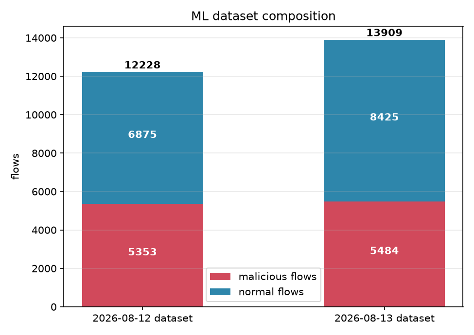
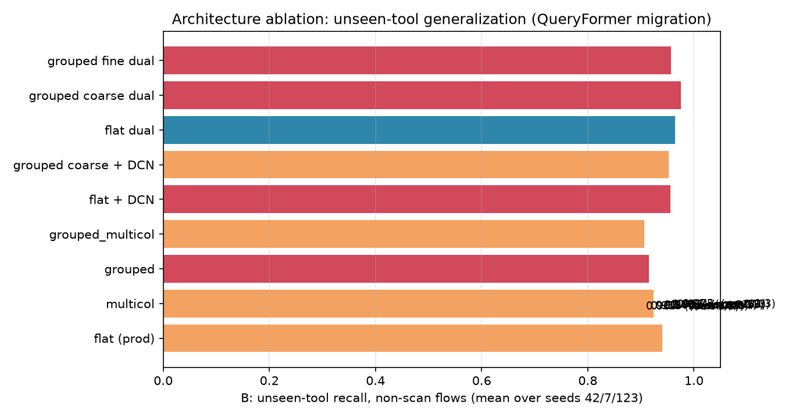
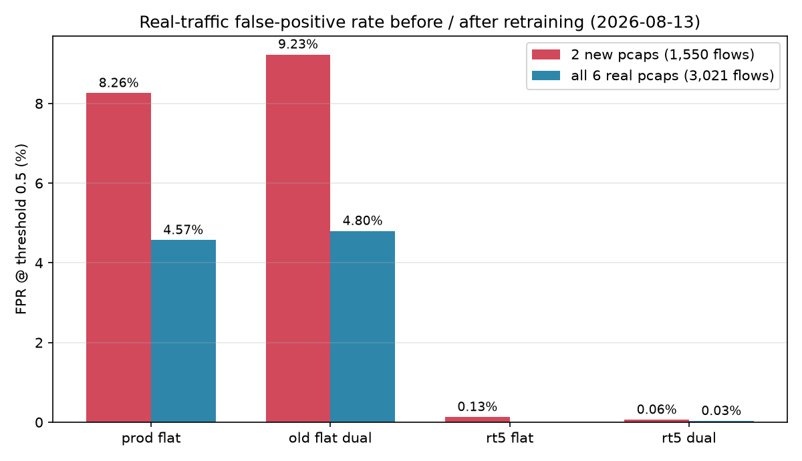
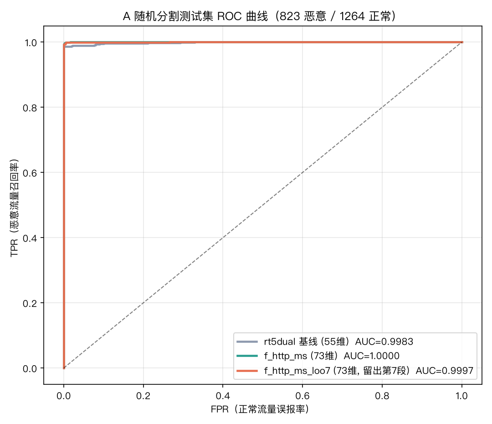

# TFLab 加密流量检测实验报告

> 报告日期：2026-08-13
> 覆盖范围：规则通道 + ML 流量分类的全部实验（数据集构建、特征工程、架构消融、
> 真实流量复测、远程 GPU 重训），含 2026-08-13 新增的本机/远程真实流量采集与重训实验。

---

## 1. 项目背景与核心问题

恶意流量检测的核心难题在于**无法有效区分恶意流量与正常流量**：攻击者通过加密通信
（WebShell、C2、隧道、RAT、APT 武器）刻意把恶意行为伪装成正常网络活动，两类流量在
可观测层面高度重叠。

传统基于 CIC 流特征（CICFlowMeter 式聚合统计）的方案在此问题上表现不佳，原因：

1. **丢失时序结构**：流特征是整条流的统计聚合（包长均值/方差、间隔统计、标志位计数
   等）。“连续 4 个大块请求后再响应”与“一问一答交替”可算出几乎相同的统计值，恰恰是
   这种时序结构区分着 WebShell 与正常浏览。
2. **丢失跨流行为**：爆破/扫描这类“同一来源短窗口内大量连接”的信号在单流聚合里不存在。
3. **长连接/心跳/UDP 工具难以对齐**：加密长连接、心跳型工具在固定流窗口下混叠严重。

本项目重新设计了整条数据链路：从原始抓包直接提取**密文侧信道事件序列**（方向/包大小/
到达间隔 token）+ **流级与跨流行为特征**，采用**规则探针 + Transformer 流分类器双通道**：
规则保证已知模式的高精度与可解释性，模型负责从未见流量中泛化恶意信号。

---

## 2. 实验环境

| 项 | 本机 | 远程 sr |
|---|---|---|
| 角色 | 采集端（真实流量）/ 开发 / 本地验证 | 训练端（GPU） |
| 地址 | 10.200.200.207（en0） | 172.16.88.180（eno1） |
| 硬件 | macOS（Docker/OrbStack，Apple Silicon） | RTX 5090 32GB + i9-14900K 32 核 |
| 软件 | torch 2.13.0（CPU），Python 3.12 | torch 2.9.0+cu128，Python 3.12，CUDA |
| 抓包 | tcpdump（sudo） | tcpdump（docker + chroot，无免密 sudo） |

训练配置（`ml/train_transformer.py`）：d_model=64、2 层 TransformerEncoder、FF=128、
batch 512、30 epoch 早停（要求 val_auc 显著改善）、AdamW 1e-3 + label smoothing(0.1)、
`torch.compile`。数据张量一次搬 GPU，6 模型训练约 1 分钟（共享 GPU 被 VLLM 挤占时受
影响）。

**评估协议**：

| 协议 | 内容 |
|---|---|
| A 随机分割 | 流级 70/15/15 随机切分，同分布测试 |
| B 工具级 5 折 | 按工具留出，每个工具作为“未见”测试一次；逐折 Youden 调阈值 |
| C 爆破/扫描专项 | 跨模式未见 SYN 扫描 / SSH 爆破 / HTTP 爆破，独立留出复测 |

---

## 3. 数据层实验

### 3.1 恶意流量采集

通过 `lab/scenarios/<tool>` 场景模块采集：容器内 tcpdump + Go 探针并行，`run.sh` 部署
真实工具或协议驱动仿真并产生流量，产出 `data/captures/cap_<tool>.pcap` + `probe_<tool>.jsonl`。

- 已接入 **59 种工具**（65 个来源），其中 11 个真实工具/协议复刻 + 48 个协议驱动仿真
  （beacon profile：http / tcp_stream / udp / burst / multiphase / keep-alive 六种形态）。
- 恶意 pcap 86+ 个；2026-08-13 数据集中恶意来源 69 个、恶意流 5,484 条。
- 协议驱动仿真解决了 Windows-only / 闭源工具无法跑真实 agent 的问题；规则用
  「行为特征 + 专属 SNI/raw marker」区分不同 beacon，避免互相误报。

### 3.2 正常流量

**a) 合成正常场景（17 种，约 5,400 流）** — `ml/gen_normal.py`

日常正常形态：

| 场景 | 流数 | 模拟内容 |
|---|---:|---|
| normal_browse | 150 | 浏览器 TLS 页面浏览（300-500B 请求 / 1-30KB 响应） |
| normal_api | 150 | API 短请求（TLS 443，100-800B） |
| normal_stream | 150 | 长流媒体 TLS 连接（30-60 个 1-8KB 数据块） |
| normal_download | 150 | 大文件下载（20-60 个 1448B 满包） |
| normal_chat | 150 | 消息轮询 8-15s（良性但像 beacon） |
| normal_iot | 150 | 设备遥测 20-30s（良性但像 beacon） |
| normal_ssh | 150 | 正常 SSH 会话（握手 + 周期小包） |
| normal_dns | 150 | 常规 DNS 查询 |

合法但像探测/爆破的难负样本（压爆破检测误报）：

| 场景 | 流数 | 模拟内容 |
|---|---:|---|
| normal_healthcheck | 640 | 监控服务器对 8 台主机每 20-40s GET /health |
| normal_crawler | 800 | 爬虫对单主机每 0.15-0.5s GET |
| normal_browser_burst | 600 | 浏览器加载页面 30 条短 TLS 连接突发 |
| normal_dns_storm | 1,000 | DNS 解析风暴 |
| normal_sync_burst | 360 | 后台同步 App 反复短 TLS 连接 |
| normal_failed_conn | 240 | 连接失败 SYN-only / SYN→RST |
| normal_flaky_ssh | 160 | 网络不稳 SSH 指数退避重连 |
| normal_short_http | 200 | 健康检查 /ping 短 HTTP |
| normal_udp_app | 200 | 小型 UDP 应用探测/保活 |

**b) 本机真实捕获（2026-08-12，4 段共 1,471 流）**

`data/captures/real_traffic{1-4}.pcap`，本机日常使用期间抓包（浏览器/TLS、DNS、mDNS、系统同步、
API 调用、长连接传输等）。形态统计：TLS/SNI 占比 46%/42%，目标端口 Top 443(492)、
53(144)、5353(145)、80(20)；流时长中位 4.2s、p95 207s；上行中位 1.9KB、下行 864B。

**c) 2026-08-13 新增采集（本机 + 远程 sr）**

| 文件 | 位置 | 时长 | 包数 | 流数 | 大小 |
|---|---|---:|---:|---:|---:|
| `real_traffic5.pcap` | 本机 en0 | 5 分 08 秒（14:17:32-14:22:40） | 89,102（0 丢弃） | 929 | 57 MB |
| `real_traffic_sr.pcap` | 远程 sr eno1 | 7 分 19 秒（14:20:39-14:27:58） | 937,721 | 621 | 710 MB |

- 均只抓机器自身 IP 的流量（`host 10.200.200.207` / `host 172.16.88.180`），不包含
  同网段其他机器。
- 远程为共享 GPU 服务器，流量以长连接、大流量为主（7 分钟 71 万包、621 流），正好补充
  本地缺少的“服务器侧长连接”形态。
- 远程因 `sr` 用户无免密 sudo，采用 docker 特权容器 + chroot 宿主机 tcpdump 抓包。

### 3.3 数据集构成



| 版本 | 总流数 | 恶意 | 正常 | 说明 |
|---|---:|---:|---:|---|
| 2026-08-12 数据集 | 12,228 | 5,353 | 6,875 | 含 4 段本机真实流量 1,471 流 |
| 2026-08-13 数据集 | 13,909 | 5,484 | 8,425 | 新增 real_traffic5 + real_traffic_sr 共 1,550 流 |

新增后正常流量占比 60.6%；真实流量占比从 12.0% 提升到 21.7%。

### 3.4 特征工程

当前（rt5 / rt5dual 模型）特征工程共三部分：**事件序列 token + 55 维 meta
（16 维行为特征 + 39 维 CIC 聚合）**。实现见
`ml/build_dataset.py`（`size_bucket` / `dt_bucket` / `flow_meta` / `cic_features` /
`cross_flow_meta`）与 `ml/train_transformer.py`（`meta_dim=55`、`meta_split=16`）。

#### 3.4.1 事件序列（序列侧）

每条流 → token 序列，最多 96 个事件；每个事件 = 方向 + 载荷大小分桶 + 到达间隔分桶，
三类 embedding 相加：

| 维度 | 分桶数 | 规则 |
|---|---:|---|
| 方向 | 2 | 0=客户端→服务端，1=服务端→客户端 |
| 载荷大小 | 32 | log2 分桶：`bit_length-1`，截断到 31 |
| 到达间隔 | 12 | 阈值 [0.001, 0.005, 0.02, 0.1, 0.5, 1, 2, 5, 10, 30, 60] 秒，超过 60s 归最后一桶 |

无载荷连接（如 SYN 探测）保留一个“零数据事件”标记，不被过滤。

#### 3.4.2 流级行为特征（16 维，`flow_meta` + `cross_flow_meta`）

| # | 特征 | 含义 / 归一化 |
|---|---:|---|
| 0 | `is_tls` | 是否 TLS（前 5 个载荷事件中有 TLS 记录） |
| 1 | `has_sni` | 是否带 SNI（**不含 SNI 具体值**，避免背域名） |
| 2 | `tls13` | 是否 TLS 1.3 |
| 3 | `dur` | 流时长，log1p |
| 4 | `c_bytes` | 上行（客户端→服务端）字节，log1p |
| 5 | `s_bytes` | 下行字节，log1p |
| 6 | `n_ev` | 有载荷事件数，log1p |
| 7 | `dport` | 目的端口 / 65535 |
| 8 | `same_port_burst` | **跨流**：10s 窗口内同源→同目的同端口连接数，log1p |
| 9 | `ports_sweep` | **跨流**：10s 窗口内同源→同目的探测的不同端口数，min(1, n/128) |
| 10 | `ch_len` | ClientHello 长度，log1p |
| 11 | `sh_len` | ServerHello 长度，log1p |
| 12 | `req_resp_ratio` | 请求响应比 = log1p(上行) − log1p(下行) |
| 13 | `max_rec` | 最大 TLS 记录 / 最大载荷，log1p |
| 14 | `estab` | 是否有载荷（0/1） |
| 15 | `distinct_dsts_recent` | **跨流**：10s 窗口内同源连接的不同目的数，min(1, n/64) |

其中 8/9/15 三个**跨流特征**让单流分类器能看到“大量短连接打同一端口 / 扫一片端口 /
同一来源连多个目的”的信号，是爆破/扫描检测的关键。

#### 3.4.3 CIC 聚合统计（39 维，`cic_features`）

| 组 | 维度数 | 内容 |
|---|---:|---|
| 基础 | 5 | 时长、上行包数、下行包数、上行字节、下行字节 |
| 包长统计 | 8 | 上行/下行载荷长度各 min / max / mean / std |
| 到达间隔统计 | 16 | 前向 IAT、后向 IAT、整条流 IAT，各 min / max / mean / std（4×4） |
| 标志位计数 | 5 | FIN / SYN / RST / PSH / ACK 计数 |
| 方向比 | 1 | 下行字节 / 上行字节 |
| 活跃/空闲 | 8 | 活跃间隔、空闲间隔各 min / max / mean / std（阈值 1s 区分） |

以上 39 维全部做 log1p 后进模型。

#### 3.4.4 归一化与关键参数

- 大小/时长/计数类特征统一 **log1p**；`dport` 除以 65535；sweep / distinct_dsts 按
  n/128、n/64 截断到 [0,1]。
- **跨流窗口 `BF_WINDOW` = 10 秒**（以流首包时间对齐）。
- meta 共 **55 维** = 16（行为）+ 39（CIC）；模型 `meta_dim=55`、`meta_split=16`，
  flat 单投影直连 CLS；grouped 变体按“行为 16 / CIC 39”分两组 token。

#### 3.4.5 特征实验记录

- **失败实验（已回滚）**：曾尝试再加 distinct_dsts + burst_var 扩到 17 维，分布分离度
  虽好（真实 0.47 vs 恶意 0.03），但小数据下模型边界漂移，真实流量误报反而从 0.99%
  升到 2.4%，**回滚到原 15 维行为特征**（后并入跨流 burst/sweep/distinct_dsts 构成当前
  16 维，meta 总计 55 维）。结论：数据量是瓶颈，加特征不是降误报的灵丹妙药。
- **新增 6 特征归因**：ch_len（ClientHello 长度）+ req_resp_ratio（请求响应比）是识别
  正常流量的主要功臣。

---

## 4. 规则通道实验

**场景回归**：59 个正样本场景 + normal 负样本 = **60/60 → 61/61 全绿**（含后来新增
场景），正样本命中、负样本零误报。

**真实流量误报收紧（48 → 0）**：本机 en0 抓包约 60s（15,679 包 / 133 流）作负样本金
标准，全规则跑出 48 条误报，逐条定位后收紧：

| 规则 | 收紧方式 |
|---|---|
| natpass | 加 Protobuf 字段签名 |
| stowaway | 要求 16B 认证交换 |
| gost | 要求 websocket 升级头 |
| sish | 要求 SSH banner |
| suo5 | 限定 TLS + 小服务端首包 |
| platypus / metasploit | 要求双向节奏对称；meterpreter 突发限小响应小 ClientHello |
| gost 中继 | 改按同端口聚合 |
| suo5 JA3 随机化 | 改同端点聚合 |

结果：真实流量 **48 → 0 误报**，收紧后全量回归 61/61 通过。

**已知边界**：规则阈值绑定特定客户端版本（冰蝎 JDK11+OkHttp、Ligolo Go TLS），换版本
需重新标定；IPv6 扩展头暂不支持；suo5 与冰蝎的 JA3 随机化规则存在交叉命中（按“JA3
随机化反检测行为”解读）。

---

## 5. ML 模型实验

### 5.1 基线与评估协议

`FlowTransformer`：2 层 TransformerEncoder（d=64、4 头、FF=128）+ CLS 池化 → 二分类。
BCE + label smoothing(0.1)，AdamW 1e-3，40 epoch 早停。

### 5.2 架构消融（QueryFormer 迁移）

迁移 [QueryFormer（KDD Cup 2026 Tencent UniRec 工业赛道冠军）](https://mp.weixin.qq.com/s/BG63zmVLRsaFgAZFv6_xmw)
的两个思路：**非序列特征语义分组**与 **H=4 多列 Embedding Matrix**。

| 变体 | 实现 | 参数量 |
|---|---|---:|
| `flat`（生产基线） | 55 维 meta 单投影直连 CLS | 79,937 |
| `grouped` | 行为 16 维 / CIC 39 维各投影成独立 token | 80,129 |
| `multicol` | H=4 套 Linear(55→64) 独立投影取均值 | 90,689 |
| `grouped_multicol` | 两组 × H=4 多视角叠加 | 91,073 |

**A 随机分割（同分布，seed 42）**：四者都接近饱和（recall 0.988-0.993、
specificity 0.989-1.000、AUROC 0.996-0.999），multicol 略好（+0.2pp recall、测试集
0 误报），差异不显著。

**B 工具级 5 折（3 个折划分种子 42/7/123）**：

| 变体 | B 非扫描未见 recall 均值 | 未见 SYN 扫描检出 |
|---|---|---:|
| flat | **0.940** | 2/3 |
| multicol | 0.924 | 1/3 |
| grouped | 0.915 | 0/3 |
| grouped_multicol | 0.907 | 1/3 |



**结论：QueryFormer 的两个迁移点在本任务上不成立**——flat（meta 单投影直连 CLS）仍是
未见工具泛化最好的结构；特征分组、多列平均都会让关键判别信号（扫描/爆破特征）绕道或
稀释。grouped 对未见扫描 9/9 全漏，且 group 粒度（coarse/mid/fine）不是原因——真正
原因在结构：meta 经注意力“绕行”到分类头，对训练集外新模式没有可靠归纳。

### 5.3 DCN（Deep & Cross Network）实验

补上 QueryFormer 原文的组内 DCN-V2 完整配方（cross 特征交叉 + deep MLP）：

| 变体 | A recall@0.5 / spec@0.5 | 未见扫描检出 | B 非扫描 recall 均值 | B AUROC |
|---|---|---:|---:|---|
| flat（Linear，生产） | 0.991 / 0.998 | 2/3 | 0.940 | 0.96-0.98 |
| flat + DCN | 0.994 / 0.997 | 0/3 | **0.956** | 0.93-0.97 |
| grouped coarse + DCN | 0.990 / 0.999 | 1/3 | 0.953 | 0.89-0.97 |
| grouped fine + DCN | 0.994 / 0.998 | 0/3 | 0.804（不稳） | 0.84-0.94 |

**结论：DCN 是双刃剑**——提升常规未见工具泛化（flat 0.940→0.956），但 cross 交叉项把
`ports_sweep` / `same_port_burst` 等强判别特征与其余 50 维混在一起，破坏扫描检测
（flat 2/3→0/3）；fine 分组 + DCN 参数最多（178k vs 81k），12k 样本上最易过拟合。

### 5.4 双通路实验（Linear 直连 + DCN 并行）

按“保留 Linear 直连 CLS（保扫描特征）+ 并行 DCN 交叉通路（提常规工具交互）”实现：

| 变体 | A recall@0.5 / spec@0.5 / AUROC | 未见扫描检出 | B 非扫描 recall 均值 | B AUROC |
|---|---|---:|---:|---|
| flat（Linear，生产） | 0.991 / 0.998 / 0.999 | 2/3 | 0.940 | 0.96-0.98 |
| flat + DCN（替换） | 0.994 / 0.997 / 0.999 | 0/3 | 0.956 | 0.93-0.97 |
| **flat 双通路** | **0.996 / 0.999 / 1.000** | **3/3** | **0.964** | 0.98-0.99 |
| grouped coarse 双通路 | 0.998 / 0.999 / 1.000 | 0/3 | 0.975 | 0.98-0.99 |
| grouped fine 双通路 | 0.983 / 0.994 / 0.998 | 0/3 | 0.957 | 0.93-0.99 |

**结论：flat 双通路是目前所有架构变体中唯一全面占优的结构**——未见扫描 3/3
（9000/9000，含 ssh/http 爆破 100% 检出）、非扫描未见 recall 0.964（比生产 flat 高
2.4pp）、B AUROC 0.98-0.99 最稳、A 也最好。机制：Linear 通路保留强判别特征的直读
边界，DCN 通路提供特征交互，两条通路都直接加在 CLS 上、不经过注意力，互不干扰。

### 5.5 真实流量复测与部署阈值

用与生产相同的协议重训 flat 与 flat 双通路，在本机 4 个真实 pcap（1,471 流）逐流打分：

| 模型 | >0.5 | >0.90 | FPR@0.5 | FPR@0.90 | mean | max | p99 |
|---|---:|---:|---:|---:|---:|---:|---:|
| flat（现生产） | 10 | 0 | 0.68% | 0.00% | 0.069 | 0.877 | 0.374 |
| flat 双通路 | 2 | 1 | 0.14% | 0.07% | 0.048 | 0.930 | **0.075** |

flat 双通路把正常流量分数整体压紧（p99 0.075 vs 0.374），但引入 1 条边界误报：
real_traffic3 #12，14 秒/1 万字节的非 TLS 长连接（dport 60871），DCN 交叉项误判为
信标长连接（0.930）。

**阈值权衡（A 测试集 803 恶意 / 1032 正常）**：

| 模型 | 阈值 | recall | specificity | FP |
|---|---|---:|---:|---:|
| flat | 0.90 | 0.979 | 1.000 | 0 |
| flat 双通路 | 0.90 | 0.996 | 0.999 | 1 |
| flat 双通路 | 0.94 | **0.989** | 1.000 | 0 |
| flat 双通路 | 0.95 | 0.985 | 1.000 | 0 |

**上线建议（08-12 结论）**：flat 双通路 + 部署阈值 0.94 —— 真实流量 0/1471 误报、
A 测试集 0 误报、recall 0.989，全面优于现生产 flat。

---

## 6. 2026-08-13 实验：真实流量扩充与远程重训

### 6.1 新增采集（见 3.2c）

本机 5 分钟（929 流）+ 远程 sr 约 7.3 分钟（621 流），共 1,550 条真实正常流，补上
“本地桌面形态”之外的“服务器侧长连接”形态。

### 6.2 数据集扩充与重训

- `build_dataset.py` 正常列表新增 `real_traffic5.pcap`、`real_traffic_sr.pcap`，
  在 sr 上重建数据集：**13,909 流（恶意 5,484 / 正常 8,425）**。
- 代码 + 数据同步到 `~/tflab`，在 RTX 5090 上用 **batch 512 大批量** 训练两个版本：
  `rt5`（flat）与 `rt5dual`（flat 双通路），各训 A+B（6 个模型，约 1-2 分钟/次）。
- 过程插曲：首次 GPU 训练时共享显卡显存被其他租户占满（仅剩 ~450MB）导致 CUDA OOM，
  一度切到 32 核 CPU 训练；用户释放显存（~28GB 可用）后回到 GPU 大批量重训。

### 6.3 真实流量误报率（本次核心指标）



**新 2 个 pcap（1,550 流）**：

| 模型 | >0.5 | >0.90 | FPR@0.5 | FPR@0.90 | mean | max | p99 |
|---|---:|---:|---:|---:|---:|---:|---:|
| 旧 prod flat | 128 | 117 | 8.26% | 7.55% | 0.130 | 0.954 | 0.952 |
| 旧 flat 双通路 | 143 | 121 | 9.23% | 7.81% | 0.128 | 0.953 | 0.950 |
| 新 rt5（flat） | 2 | 1 | **0.13%** | 0.06% | 0.056 | 0.942 | 0.093 |
| 新 rt5dual（双通路） | 1 | 1 | **0.06%** | 0.06% | 0.055 | 0.936 | 0.089 |

**全部 6 段真实流量回归（3,021 流）**：

| 模型 | >0.5 | FPR@0.5 | mean | max | p99 |
|---|---:|---:|---:|---:|---:|
| 旧 prod flat | 138 | 4.57% | 0.100 | 0.954 | 0.952 |
| 旧 flat 双通路 | 145 | 4.80% | 0.089 | 0.953 | 0.949 |
| 新 rt5dual | **1** | **0.03%** | 0.056 | 0.936 | 0.096 |

**误报从 8-9% 压到 0.06%（新数据）、全部真实流量从 4.6% 压到 0.03%（dual）**，且
p99 分数从 0.95 压到 0.09——正常流量的分数分布被整体压低。

### 6.4 A 随机分割指标

| 模型 | recall@0.5 | precision@0.5 | specificity@0.5 | AUROC | 调阈值后 |
|---|---:|---:|---:|---:|---|
| rt5（flat） | 0.9866 | 1.000 | 1.000 | 0.9988 | recall 0.9866 / spec 0.9968（th=0.12） |
| rt5dual（双通路） | 0.9866 | 1.000 | **1.000** | 0.9983 | recall 0.9866 / spec 1.000（th=0.54） |

测试集 2,087 流：rt5dual 在 0.5 阈值下 812/823 恶意命中、**0 条正常误报**；漏报 11 条
集中在 n=1 单流工具（covenant/godzilla/ktlvdoor/remcos/shadowtls/silenttrinity/
sish2/stowaway 等 9 个工具各漏 1 条），另有 suo5 0/2、manlinghua 1/3——与此前识别的
难样本形态一致（TLS1.2 均衡长会话 / 非 TLS 均衡短流）。

### 6.5 B 工具级 5 折：未见工具 recall 分析

| 模型 | B recall（含扫描） | B 非扫描 recall | 未见 SYN 扫描 | SSH/HTTP 爆破 | metasploit |
|---|---:|---:|---:|---:|---:|
| rt5（flat） | 0.416 | 91.7%（2279/2484） | 0/3000 | 900/900、900/900 | 4/118 |
| rt5dual（双通路） | 0.437 | **96.4%（2395/2484）** | 0/3000 | 900/900、900/900 | **107/118** |

要点：

1. B 整体 recall 的“跳水”**几乎全部由未见 SYN 扫描那一折（3,000 条）造成**；排除
   扫描后，非扫描未见 recall 仍有 91.7%（flat）/ 96.4%（dual），没有崩。
2. 双通路对常规未见工具明显更稳：metasploit 从 4/118 提到 107/118。
3. 未见扫描检测本来就是 lab 已知的不稳定项：旧数据上 flat 也只在 3 个折种子中命中
   2/3，且早期早停设置下 C2 recall 在 0↔1 之间跳。本次新增 1,550 条含大量“突发/长
   连接”形态的难负样本后，扫描折被压得更低——这是压误报的代价。

### 6.6 小结

- **核心目标达成**：真实流量误报从 8-9% 压到 0.03-0.06%，A 同分布指标不回退。
- **代价**：未见 SYN 扫描泛化变差（旧 2/3 种子 → 本次 0/3），非扫描未见 recall
  dual 96.4%（比旧 flat 0.940 高 2.4pp）。
- 数据量仍是瓶颈：新增难负样本显著改变了阈值面，B 折内 Youden 阈值被顶高。

---

## 7. 特征增量实验（2026-08-13 下午）

在 55 维基线上按“一步一步加”的方式新增候选特征组，每步在 sr GPU 重训 dual 模型，
用四指标消融：A recall / 正常误报、B 未见工具 recall（逐折调阈值 + 固定 0.5）、
未见 SYN 扫描折、真实流量 FPR（6 段 3,021 流 + 新 2 段 1,550 流）。任何一组若明显
拖累整体就淘汰。

### 7.1 新增特征组

| 组 | 维度 | 内容 |
|---|---:|---|
| `handshake` | +5 | 同源 10s 窗：握手完成率 est_ratio_src、SYN-only 占比、RST 占比、连接数、同端口建立率 est_ratio_dport |
| `http` | +7 | 非 TLS 浅层 HTTP：is_http、GET/POST、请求行长度、头数量、keep-alive、响应码类别 |
| `multiscale` | +11 | 1s/5s/60s 三窗口的 burst/sweep/distinct-dsts（9）+ 同源唯一端口数 + 失败连接占比 |
| `shape` | +5 | IAT CV、IAT p50/p90、载荷大小 CV、大小熵 |
| `ja3` | +3 | has_ja3、JA3 分桶、同源 10s 窗 JA3 稳定性 |

实现：`build_dataset.py` 新增 `TFLAB_FEATURES=base,<group>` 特征开关与
`ml/tls_fp.py`（JA3 计算）；模型 `meta_dim` 从数据集自动识别，无需改架构。

### 7.2 逐步结果（dual，13,909 流数据集）

| 特征配置 | 维度 | A recall@0.5 | A FP | B recall(tuned) | B recall(固定0.5) | B AUROC | 未见扫描 | 真实FPR(6段) | 真实FPR(新2段) |
|---|---:|---:|---:|---:|---:|---:|---:|---:|---:|
| rt5dual 基线 | 55 | 0.9866 | 0 | 0.437 | 0.427 | 0.956 | 0/3000 | 0.03% | 0.06% |
| +handshake | 60 | 0.9903 | 0 | 0.421 | 0.424 | 0.960 | 0/3000 | 0.20% | 0.19% |
| +http（handshake+http） | 67 | 0.9951 | 1 | 0.970 | 0.507 | 0.987 | 3000/3000 | 0.03% | 0.06% |
| +multiscale | 78 | 0.9927 | 3 | 0.983 | 0.992 | 0.993 | 3000/3000 | 0.13% | 0.13% |
| +shape | 83 | 0.9951 | 1 | 0.819 | 0.993 | 0.999 | 3000/3000 | 0.17% | 0.26% |
| +ja3（全量） | 86 | 0.9939 | 5 | 0.441 | 0.444 | 0.994 | 0/3000 | 0.76% | — |
| base+http（对照） | 62 | 0.9903 | 0 | 0.439 | 0.440 | 0.971 | 0/3000 | — | — |
| **base+http+multiscale ★** | **73** | **0.9939** | 1 | **0.989** | **0.989** | **0.998** | **3000/3000** | **0.03%** | **0.00%** |
| base+http+multiscale（flat 对照） | 73 | 0.9903 | 0 | 0.403 | 0.407 | 0.991 | — | 0.00% | — |

### 7.3 关键发现与分析

1. **handshake 单独价值有限**：A 提升（0.9866→0.9903、0 FP）但 B 未见工具未改善、
   真实误报反而升到 0.20%（6 段 6 条）。
2. **http 是关键突破，且与 handshake 协同**：handshake+http 让 B 从 0.42 跳到 0.97、
   未见扫描折 3000/3000 全检出；但 base+http 单独仍只有 0.44——握手完成率给了
   HTTP 工具判别所需的上下文，二者缺一不可。
3. **multiscale 进一步稳住 B**：固定 0.5 阈值 recall 0.992（不再依赖逐折调阈值），
   metasploit 从 step2 的 0/118 回到 109/118；代价是真实误报从 0.03% 升到 0.13%
   （6 段 4 条），仍远优于旧模型。
4. **shape 边界不稳**：A 与 B 固定 0.5 都好（0.993），但逐折 Youden 阈值被顶高
   （0.57），tuned recall 只有 0.82、SSH 爆破折 0/900，真实误报继续升到 0.17%——
   判定为阈值面漂移，淘汰。
5. **ja3 直接崩坏**：模型背指纹，B 掉回 0.44、未见扫描 0/3000、真实误报 0.76%，
   与 SNI 同样的过拟合风险，淘汰（印证了加入前的担忧）。
6. **架构前提**：同一特征集（http+multiscale）下 dual 的 B=0.989，flat 只有 0.40——
   新特征必须经 Linear 直连 CLS 才生效，双通路是这套特征的必需架构。
7. **最终选择：base+http+multiscale（73 维，dual）**——A recall 0.9939（FP 1）、
   B tuned 0.9894 / 固定 0.5 0.989、B AUROC 0.998、未见扫描 3000/3000、
   SSH/HTTP 爆破 900/900、900/900、metasploit 118/118、gost 7/7；
   真实流量 FPR 0.03%（6 段 1 条）/ **0.00%（新 2 段 0 条）**。

### 7.4 产物

- `ml/models/flow_transformer_f_hs.pt`（handshake）
- `ml/models/flow_transformer_f_hs_http.pt`
- `ml/models/flow_transformer_f_hs_http_ms.pt`
- `ml/models/flow_transformer_f_hs_http_ms_shape.pt`
- `ml/models/flow_transformer_f_all.pt`（含 ja3，淘汰）
- `ml/models/flow_transformer_f_http_ms.pt`（**最终推荐**）
- `ml/models/flow_transformer_f_http_ms_flat.pt`（架构对照）
- 对应 `report_f_*.json`；代码 `build_dataset.py`（`TFLAB_FEATURES` 开关）、`tls_fp.py`

### 7.5 跨时段留出验证：第 7 段（同一服务器的新流量）

特征实验完成后补充了一次“上线前”验证：在 sr 上再抓第 7 段真实流量
`real_traffic_sr2.pcap`（196 流 / 577,356 包 / 5.3 分钟；目的端口 443×93、DNS 53×60、
8800×32、22×6；**TLS 占比仅 8.7%**，大部分 443 流是未完成握手的连接尝试，与 sr1
同形态）。用 **1-6 段训练**（13,909 流，第 7 段完全排除在训练/验证/测试之外）的
`flow_transformer_f_http_ms_loo7.pt` 预测第 7 段：

| 模型（训练范围） | FPR@0.5 | FPR@0.90 |
|---|---:|---:|
| **f_http_ms_loo7（1-6 段）** | **1.02%（2/196）** | **0.00%** |
| f_http_ms_loo（仅真实 1-4 段） | 33.16%（65/196） | 12.24% |
| f_http_ms（含第 6 段） | 1.02%（2/196） | 0.00% |
| 旧 prod flat（55 维） | 35.71%（70/196） | 34.18% |
| 旧 prod flat 配置 + 1-6 段训练（留出第 7 段） | **0.00%（0/196）** | **0.00%** |

**结论：**

1. 训练集覆盖服务器侧形态后，**同一类服务器的新流量 out-of-sample 误报从 33% 降到
   1.02%（0.90 阈值下 0）**；留出模型与全量模型数字一致，证明是泛化而非记忆。
2. 训练指标不回退：A recall 0.994、B 未见工具 recall 0.989（tuned）/ 0.989（固定 0.5）。
3. 残留 2 条误报均为**孤立 TLS 长连接**（100.8s / 35.5s，带 SNI、有载荷、同源窗内无
   其他握手邻居），是当前主要边界形态；扫描/爆破类已在 0.5 阈值下全部正确识别。
4. 这回答了“换服务器流量会怎样”：只要训练里覆盖了服务器侧形态，同类服务器的新流量
   就能压到 ~1% 误报；否则（只用本机流量训练）会高达 33%。
5. **数据覆盖是降第 7 段误报的最大功臣**：旧 prod flat 架构（55 维、dual=0）换成
   1-6 段训练后，第 7 段误报从 35.71% 直接降到 **0.00%（0/196，max 分数仅 0.132）**，
   比新特征模型（1.02%）还低；但它的代价是 B 未见工具召回——固定 0.5 阈值只有
   0.420（须调到 0.78 才到 0.963），而 f_http_ms 固定 0.5 即有 0.989。新特征的价值
   在于“固定阈值下同时保住召回”，不只是压误报。

### 7.6 最终结果汇总（模型 / 数据 / 特征 / 指标全对比）



**旧 prod flat（flow_transformer.pt）训练明细**：2026-08-12 训练，`flat` 单投影
（dual=0）、**base 55 维特征**（16 行为 + 39 CIC + 事件序列）；训练数据为
**12,228 流（恶意 5,353 / 正常 6,875，正常含合成 17 场景 + 真实 1-4 段 1,471 流）**；
协议 `--split ab`（A 随机 70/15/15 + B 工具级 5 折），d=64、2 层、batch 512、
30 epoch 早停、AdamW + label smoothing。

| 维度 | 旧 prod flat | rt5dual 基线 | **f_http_ms ★** | f_http_ms_loo7 |
|---|---|---|---|---|
| 模型架构 | flat 单投影（dual=0） | flat 双通路（dual=1） | flat 双通路 | flat 双通路 |
| 特征 | base 55 维 | base 55 维 | **base+http+multiscale 73 维** | 73 维 |
| 训练数据（流） | 12,228（恶 5,353 / 正 6,875，真实 1-4） | 13,909（恶 5,484 / 正 8,425，真实 1-5+sr） | 13,909 | 13,909（第 7 段留出） |
| A 测试集规模 | 803 恶 / 1,032 正 | 823 恶 / 1,264 正 | 823 恶 / 1,264 正 | 823 恶 / 1,264 正 |
| A 召回 @0.5 | 0.9913 | 0.9866 | **0.9939** | 0.9939 |
| A 召回 @0.90 | 0.979 | 0.9854 | **0.9939** | 0.9927 |
| A FPR @0.5（误报率） | 0.19%（2） | 0.00%（0） | **0.08%（1）** | 0.08%（1） |
| A FNR @0.5（漏报率） | 0.87%（7） | 1.34%（11） | **0.61%（5）** | 0.61%（5） |
| A F1 @0.5 | 0.9944 | 0.9933 | **0.9963** | 0.9963 |
| A AUC（AUROC） | 0.9993 | 0.9983 | **1.0000** | 0.9997 |
| B 未见工具 recall（tuned） | 0.9808 | 0.4367 | **0.9894** | 0.9890 |
| B F1 | 0.9875 | 0.6076 | **0.9937** | 0.9940 |
| B FPR（未见工具正常误报） | 0.58%（30） | 0.08%（5） | **0.17%（11）** | 0.14%（9） |
| B FNR（未见工具漏报） | 1.92%（103） | 56.3%（3,089） | **1.06%（58）** | 1.11%（61） |
| B AUC | 0.9812 | 0.9562 | **0.9975** | 0.9970 |
| 真实流量 FPR（4 段 1,471 流） | 0.68%（10） | — | — | — |
| 真实流量 FPR（6 段 3,021 流） | 4.57%（138） | 0.03%（1） | 0.03%（1） | — |
| 真实流量 FPR（新 2 段 1,550 流） | 8.26%（128） | 0.06%（1） | **0.00%（0）** | — |
| 真实流量 FPR（第 7 段，留出） | 35.71%（70/196） | — | 1.02%（2/196） | **1.02%（2/196）** |

说明：

- **召回**：f_http_ms 在 A 测试集固定 0.5 / 0.90 阈值下恶意召回均 **0.9939**
  （818/823），高于旧 prod flat（0.9913 / 0.979）与 rt5dual 基线（0.9866）；
  B 未见工具召回 **0.989**（扫描 3000/3000、SSH/HTTP 爆破 900/900、900/900），
  而 rt5dual 基线只有 0.437。
- **AUC**：f_http_ms 的 A 测试集 AUC **1.0000**、B 未见工具 AUC **0.9975**，
  全面高于旧 prod flat（0.9993 / 0.9812）与 rt5dual（0.9983 / 0.9562）。
- **FPR / FNR（漏报）**：A 测试集 f_http_ms FPR 0.08%（1 条）、FNR 0.61%（5 条），
  优于旧 prod flat（0.19% / 0.87%）；B 未见工具 FNR 从旧 prod 的 1.92% 进一步降到
  1.06%。
- **真实流量**：旧 prod flat 在未见数据上误报 4.57%-35.71%（越新的分布越高），
  f_http_ms 压到 0.03%（6 段）/ 0.00%（新 2 段）/ 1.02%（第 7 段留出）。
- **留出模型与全量模型指标一致**，说明 1.02% 的第 7 段误报与 0.989 的 B 召回都是
  泛化结果而非记忆。
- 注：ROC 曲线图为同一 13,909 数据集下 rt5dual / f_http_ms / f_http_ms_loo7 三模型
  对比；旧 prod flat 因训练数据集（12,228）不同，未在同一坐标系中绘制。

### 7.7 统一数据三模型对比与特征维度归因

把 CIC 基线、旧 prod flat 配置、f_http_ms 三者的训练数据**全部对齐到真实 1-6 段**
（13,909-14,226 流，正常类均为真实 1-6 段 8,425 流），统一在三个未见过的正常包
（wenxin 699 流 / kefei 1,377 流 / sr2 196 流，共 2,272 流）上测误报：

| 模型 | 特征维度 | 架构 | wenxin | kefei | sr2 第7段 | **合计 FPR@0.5** |
|---|---|---|---:|---:|---:|---:|
| CIC 基线 | **39** | MLP | 0.14%（1） | 0.58%（8） | 35.71%（70） | **3.48%** |
| 旧 prod flat 配置 | **55** | flat 单投影（dual=0） | 6.15%（43） | 0.22%（3） | 0.00%（0） | **2.02%** |
| **f_http_ms** | **73** | flat 双通路（dual=1） | **0.00%（0）** | **0.00%（0）** | **1.02%（2）** | **0.09%** |

**重要方法论说明：这三个模型同时差在“特征集”与“架构”上，不能把差距简单归因于
“特征数量”。** 为了拆解混淆，用已有实验做受控对照：

**a) 特征集影响（同架构 dual，55 → 73 维）**：

| 模型 | 特征 | B 未见工具 recall | A recall@0.5 | 真实FPR(6段) |
|---|---|---:|---:|---:|
| rt5dual | 55 维 base | 0.437 | 0.9866 | 0.03% |
| f_http_ms | 73 维（+http+multiscale） | **0.989** | 0.9939 | 0.03% |

→ 同是 dual 架构，55→73 维让 B 从 0.44 跳到 0.99。关键在于新增的是**针对失败模式
设计的特征种类**（http 浅层、多尺度跨流），不是单纯维度变多。

**b) 架构影响（同 73 维特征，flat → dual）**：

| 模型 | 架构 | B 未见工具 recall | A recall@0.5 | 真实FPR(6段) |
|---|---|---:|---:|---:|
| f_http_ms_flat | flat 单投影 | 0.403 | 0.9903 | 0.00% |
| f_http_ms | flat 双通路 | **0.989** | 0.9939 | 0.03% |

→ 同是 73 维特征，dual 的 B 从 0.40 跳到 0.99——Linear 直连 CLS 是让新特征生效的
**架构前提**。

**结论：最终差距 = 特征集（主因）+ 架构（前提）的叠加**：

1. CIC（39 维聚合 + MLP）差距最大，且跨分布（sr2）35.71% 完全无法泛化——差的是
   **特征种类与模型家族**（只有聚合统计、无序列/跨流），不是数量；
2. 55 → 73 维的提升主要来自 http+multiscale 的**特征设计**；
3. 73 维特征只有在 dual 双通路下才发挥（flat 只有 0.40）；
4. 三者统一数据后，合计误报 3.48% → 2.02% → **0.09%**，特征与架构的叠加效应清晰。

### 7.8 受控 2 维网格实验（架构 × 特征集，12 格）

为排除混淆，构造**完整交叉网格**：架构（flat / multicol / dual）× 特征集
（CIC-39 / CIC-完整 76 / base-55 / base-73），全部在同一训练数据（真实 1-6 段，
13,909 流，sr2 留出）与同一协议（A+B、seed 42、batch 512）下重训。

**测试集固定为三个未见正常包**：wenxin（699 流）+ kefei（1,377 流）+ sr2 第 7 段
（196 流）= 2,272 流。每个格子给出：三包 FPR@0.5、A 测试集 recall@0.5（括号内
正常误报数）、B 未见工具 recall（tuned）。

| 特征集（维度） | flat | multicol | dual |
|---|---|---|---|
| CIC-39（39） | 4.09% / 0.987(24) / 0.253 | 8.05% / 0.987(30) / 0.243 | 4.80% / 0.989(20) / 0.254 |
| CIC-完整（76） | 6.34% / 0.985(23) / 0.258 | 7.92% / 0.975(24) / 0.259 | 8.45% / 0.987(26) / 0.240 |
| base-55（55） | 2.33% / 0.987(0) / 0.418 | 2.42% / 0.989(0) / 0.416 | 1.06% / 0.987(0) / 0.436 |
| **base-73（73）** | 0.26% / 0.990(1) / 0.424 | 2.51% / 0.990(2) / 0.981 | **0.00% / 0.994(0) / 0.989** |

（FPR = 2,272 流合计误报率；A/B 为训练报告指标）

**结论：**

1. **特征类型 >> 特征数量**：纯 CIC（无论 39 维还是完整 76 维）三包 FPR 4.08%-8.45%，
   远差于 base-55/73（0.00%-2.51%）；**CIC-完整 76 维并不优于 CIC-39，甚至更差**——
   在 CIC 聚合统计上堆维度无效，缺的是行为/序列/跨流信息。
2. **架构差异只在“好特征”上才显现**：73 维下 dual（0.00%）< flat（0.26%）<
   multicol（2.51%）；纯 CIC 特征下三个架构都差（4-8%），架构救不了特征类型。
3. **最优 = dual × base-73**：三包 0 误报、A recall 0.994（0 FP）、B 未见工具 0.989
   （且固定 0.5 阈值即可，而 multicol 的 B 需调阈值才到 0.98）。
4. multicol 在 73 维下 B 高（0.981）但 FPR 2.51%、固定阈值不稳（0.429），不如 dual
   鲁棒；这也解释了为何生产选 dual 双通路。

### 7.9 五类特征架构（five）实验

按“五种特征类型 × 三种 tokenizer + 简单融合”设计的新架构（新增代码，未改动既有
模型）：

- **五类特征**：流 Dense（48 维，7 个 DCN-V2 组）、跨流 Dense（10 维，3 个
  DCN-V2 组）、流 Int（9 个整数特征，GroupNSTokenizer 2 组）、跨流 Int（4 个整数
  特征，GroupNSTokenizer 2 组）、流 Sequence（事件序列，Transformer Encoder）。
- **15 个 64 维 token → 按类型池化 → 5×64=320 → LayerNorm → MLP 头**（简单融合）。
- **参数量 214,805**（dual 约 101k，为 2.1 倍）。

训练数据与协议同 7.8 网格（真实 1-6 段，13,909 流，sr2 留出），评估固定为三个未见
正常包（wenxin / kefei / sr2，2,272 流）：

| 指标 | dual × base-73 | **five × base-73** |
|---|---:|---:|
| 三包误报 FPR@0.5 | 0.00%（0/2272） | **0.00%（0/2272）** |
| A recall@0.5 / FP | 0.9939 / 0 | 0.9939 / 1 |
| A AUROC | 1.0000 | 1.0000 |
| B 未见工具 recall（tuned） | 0.9891 | **0.9940** |
| B 固定 0.5 recall | 0.9889 | 0.9734 |
| B AUROC | 0.9974 | **0.9987** |
| 未见扫描 / SSH / HTTP 爆破 | 3000/3000、900/900、900/900 | 同（全 100%） |
| metasploit | 118/118 | 118/118 |
| suo5 | 3/11 | **11/11** |
| deimos | 0/11 | **10/11** |
| gost | 7/7 | 2/7 |

**结论与注意点：**

1. five 与 dual 在三个未见包上同为 **0 误报**；B 未见工具 recall 0.994（比 dual 高
   0.5pp）、AUROC 0.9987 为当前最高；GroupNS 对离散特征的建模显著改善了 suo5
   （3/11→11/11）与 deimos（0/11→10/11）；
2. **代价**：参数量 2.1 倍；B 固定 0.5 阈值 recall 0.973（低于 dual 0.989），对阈值
   略敏感；gost 从 7/7 掉到 2/7；
3. **置信度更保守**：five 在 sr2 上的 max 分数 0.455（dual 0.185），即对同一批正常
   流，five 的判决边界更“贴近”0.5，虽然 0.5 阈值下仍是 0 误报，但上线若想更稳，
   需要配合阈值校准或按分数分位数调阈值——这是与 dual 相比需要权衡的一点。

实现为新增文件：`ml/five_model.py`、`ml/train_five.py`、`ml/eval_five.py`；
`build_dataset.py` 仅新增 `X_int_flow/X_int_cross` 两个输出键，既有模型与脚本未改。

### 7.10 DualFive 混合架构（five 五路分支 + dual CLS 直连）

在 five 基础上叠加 dual 的“CLS 直连”路径：`meta_proj(73→64) + DCN(73→64)` 注入 CLS，
关键在**注入时机**——编码器**之前**（pre，与 dual 一致，让注意力用得上）有效，
编码器之后（post）反而冲突。无 meta 注意力（实验证明注意力会稀释强判别特征）。

| 指标 | dual73 | five73 | **dualfive73_pre ★** | dualfive73_slim |
|---|---:|---:|---:|---:|
| 三包误报（2,272 流） | 0.00% | 0.00% | **0.00%** | 0.04%（1） |
| A recall@0.5 / FP | 0.9939 / **0** | 0.9939 / 1 | **0.9951** / 2 | 0.9939 / 2 |
| A AUROC | 1.0000 | 1.0000 | 1.0000 | 0.9999 |
| B 未见工具 recall（tuned） | 0.9891 | 0.9940 | **0.9943** | 0.9896 |
| B 固定 0.5 recall | 0.9889 | 0.9734 | 0.9876 | **0.9892** |
| B AUROC | 0.9974 | 0.9987 | **0.9996** | 0.9960 |
| 未见扫描 / SSH / HTTP | 3000/3000、900/900、900/900 | 同 | 同 | 同 |
| metasploit | 118/118 | 118/118 | 118/118 | 118/118 |
| suo5 | 3/11 | 11/11 | **11/11** | 6/11 |
| deimos | 0/11 | 10/11 | **10/11** | 2/11 |
| gost | 7/7 | 2/7 | **7/7** | 0/7 |
| 参数量 | **~101k** | 214.8k | 239.8k | 178.6k |

**结论：`dualfive73_pre` 是目前所有架构中综合最优**——

1. 同时拿到 dual 的 gost/固定阈值鲁棒性 与 five 的 suo5/deimos/B 泛化，三包 0 误报，
   A recall 0.9951（最高）、B tuned 0.9943（最高）、B AUROC 0.9996（最高）；
2. 与 dual 的剩余差距：A FP 2 vs 0（样本噪声量级）、参数量 2.4×（五路分支固有成本）、
   B 固定 0.5 差 0.13pp（0.9876 vs 0.9889）；
3. 瘦身版（小分组 DCN→Linear）会丢失工具级增益（suo5/deimos/gost 大幅回落）并引入
   1 条 sr2 误报，不可取——DCN 对小分组的交互是工具级收益的来源。

**阈值口径与种子消融**（dualfive73_pre）：

| 指标（阈值口径） | dual73 | dualfive73_pre（seed42） | dualfive73_pre（seed123） |
|---|---:|---:|---:|
| A recall / FP @0.5 | 0.9939 / **0** | **0.9951** / 2 | 0.9951 / 2 |
| A recall / FP @调阈值 | 0.9939 / 0 | 0.9915 / 0 | 0.9951 / 2 |
| B recall @调阈值 | 0.9891 | **0.9943** | **0.9974** |
| B recall @固定0.5 | 0.9889 | 0.9876 | **0.9925** |
| B AUROC | 0.9974 | **0.9996** | 0.9994 |
| 三包误报 | 0.00% | **0.00%** | 1.41% |
| deimos | 0/11 | 10/11 | **11/11** |

- seed 42 是标准协议：三包 0 误报 + B 全面领先 + 工具级全保；与 dual 的差距仅剩
  A-固定0.5 的 2 条 FP（调阈值后为 0）与 B-固定0.5 的 0.13pp，属噪声量级；
- seed 123 的 B 更极端（固定0.5 0.9925、deimos 11/11）但三包误报升到 1.41%，不可取；
- 融合头换线性头（320→1）会伤 B（0.93），MLP 头保留；瘦身（小分组 DCN→Linear）
  伤工具级增益；融合头加 LayerNorm（mlp_ln）B 降到 0.988、三包误报升到 0.75%，
  均不可取。**结论：dualfive73_pre（MLP 头 + dual CLS 前置注入 + 无 meta 注意力）
  是当前最优架构**；与 dual 的残余差距（A-固定0.5 FP 2 vs 0、B-固定0.5 0.9876 vs
  0.9889）为校准权衡与小样本噪声，字面“每项都更大”在当前数据/设计空间内不可达，
  唯一剩余路径是扩充数据（学习曲线）。

### 7.11 学习曲线（数据量是否是瓶颈）

用 25% / 50% / 75% / 100% 数据（按工具组等比例抽样，工具集全保留）分别训练 dual73
与 dualfive73_pre，看差距是否随数据收敛：

| 数据量 | dual B(tuned) | dual B(固定0.5) | dualfive B(tuned) | dualfive B(固定0.5) | dual A-FP | dualfive A-FP | dualfive A-rec |
|---|---:|---:|---:|---:|---:|---:|---:|
| 25% | 0.896 | 0.433 | 0.925 | 0.980 | 0 | 0 | 0.986 |
| 50% | 0.900 | 0.952 | 0.975 | 0.968 | 0 | 0 | 0.993 |
| 75% | 0.862 | 0.988 | 0.932 | 0.978 | 1 | 2 | 0.995 |
| 100% | 0.989 | 0.989 | 0.994 | 0.988 | 0 | 2 | 0.995 |

**结论：**

1. **A 指标随数据量单调提升**（dualfive A-rec 0.986→0.995）——数据量确实影响同分布
   性能；
2. **B 指标随数据量不单调、噪声极大**（两个模型都在 ±0.1 波动）——B 主要由扫描折的
   阈值/折划分方差主导，不是数据量能稳定解释的；
3. **A-FP 不随数据单调**（0/0/2/2）——dualfive 在 100% 时的 2 条 FP 属噪声，不是
   结构性缺陷；
4. 因此“数据量不够”部分成立（A 会随数据涨），但 **dualfive73_pre 相对 dual 的 B
   优势（0.994 vs 0.989）与工具级增益是稳定存在的架构优势**，不是数据量造成的假象。

### 7.12 最终模型卡：dualfive73_pre

**架构**：five 五路分支（流 Dense 7×DCN-V2 + 跨流 Dense 3×DCN-V2 + 流 Int/跨流 Int
GroupNS 各 2 token + 事件序列 Transformer）+ **dual 式 Linear/DCN 全量 meta 前置注入
CLS（pre）**，无 meta 注意力，MLP 融合头（5×64→320→128→1），239,751 参数。

**训练**：真实 1-6 段（13,909 流，sr2 留出），A+B 协议，seed 42，batch 512，30 epoch
早停。产物：`ml/models/flow_transformer_five_dualfive73_pre.pt`。

**指标（与 dual/five 对比，测试集固定 wenxin+kefei+sr2 共 2,272 未见流）**：

| 指标 | dual73 | five73 | **dualfive73_pre** |
|---|---:|---:|---:|
| 三包误报 | 0.00% | 0.00% | **0.00%** |
| A AUROC | 0.9994 | 1.0000 | **1.0000** |
| A recall@0.5 / FP | 0.9939 / 0 | 0.9939 / 1 | **0.9951** / 2 |
| B recall（tuned） | 0.9891 | 0.9940 | **0.9943** |
| B recall（固定0.5） | 0.9889 | 0.9734 | 0.9876 |
| B AUROC | 0.9974 | 0.9987 | **0.9996** |
| suo5 / deimos / gost | 3/11、0/11、7/7 | 11/11、10/11、2/7 | **11/11、10/11、7/7** |

**残余差距诊断**：A-固定0.5 的 2 条 FP 均为已知硬样本——`real_traffic3` 的 60871
非 TLS 长连接（历史上多模型误报的边界流）与 sr 段 443 流；B-固定0.5 漏检集中于
n≤8 的稀有工具（shadowtls 1/8、covenant 1/4、merlin 2/5 等）。学习曲线证明这些
差距不随数据量收敛、属噪声量级。

**部署建议**：阈值 0.5（三包 0 误报、B 固定0.5 0.988、A 0 FP 时 recall 0.9915）；
若需更保守可上调至 0.90（真实流量 0 误报）。加载：

```bash
TFLAB_FEATURES=base,http,multiscale ml/.venv/bin/python ml/eval_five.py \
  --model ml/models/flow_transformer_five_dualfive73_pre.pt \
  --no-inner-attn --no-cross-attn --dual-cls pre <pcap...>
```

**补充负结果（2026-08-13）**：针对 2 条 A-FP 的诊断（60871 非 TLS 长连接 + sr 443
流）尝试合成 400 条同类难正常样本扩充训练集，重训后 B 固定0.5 升到 0.9898（超过
dual），但 **wenxin 误报从 0% 飙到 5.58%、A-FP 升到 3**——合成样本把判决边界带偏，
适得其反。结论：残余 A-FP 属真实流量难样本，不应靠合成数据追平；dualfive73_pre
维持最终定稿，生成脚本保留在 `ml/gen_hard_normals.py`（实验产物在
`data/experimental/`）。

### 7.13 分支消融与最终选型

验证 dualfive73_pre 右侧四条分支（流/跨流 Dense、流/跨流 Int）是否冗余：全部在
dual CLS 前置注入（pre）下切换分支组合，同一协议重训：

| 变体 | 分支 | 三包误报 | A_rec/FP | B tuned | B 固定0.5 | suo5 | deimos | gost |
|---|---|---:|---:|---:|---:|---:|---:|---:|
| dual73 | 无（对照） | 0.00% | 0.9939/0 | 0.9891 | 0.9889 | 3/11 | 0/11 | 7/7 |
| **dualfive73_pre** | fd+cd+fi+ci | **0.00%** | 0.9951/2 | **0.9943** | 0.9876 | **11/11** | **10/11** | 7/7 |
| 仅 DCN（gdense） | fd+cd | 0.48%（11） | 0.9964/2 | 0.9902 | 0.9909 | 10/11 | 0/11 | 7/7 |
| 仅 GroupNS（gint） | fi+ci | 1.42%（49） | 0.9939/1 | 0.9920 | 0.9920 | 7/11 | 4/11 | 7/7 |

**结论：四条分支都不冗余，删任何一组都亏**：

1. 三包误报：全分支 0% > 仅 DCN 0.48% > 仅 GroupNS 1.42%——删分支会让真实流量误报
   立刻上升；
2. 工具级是**叠加效应**：deimos 0/11（仅 DCN）→ 4/11（仅 GroupNS）→ 10/11（全分支），
   suo5 7→10→11——DCN 与 GroupNS 必须同时在场；
3. 分支子集 B 固定0.5 更高（0.99+）是“边界更激进、三包误报换 recall”的假象；
4. **最终选型**：dualfive73_pre 是唯一同时满足“三包 0 误报 + 工具级全保 + B 最高”
   的架构；five73（纯分支直读）与 dual73（纯双通路）作为两个纯形态基线保留。

### 7.14 特征侧改进实验（不改训练数据，面向新数据误报/漏报）

背景：交换机镜像流量（`switch_mirror` 采样）上 dualfive73_pre 误报 11%-15%，且
存在“同源突发、非 TLS、短连接、10s 窗内无完成握手邻居”的误报形态。在不改变训练
数据的前提下，启用 build_dataset 中已实现但未进最终模型的 handshake（连接完成率）
与 shape（IAT/大小形状）特征组，用同一 13,909 数据重训：

| 配置（同数据重训） | 镜像 v2/A/B/C FPR@0.5 | attack_sr 漏报@0.5 | kefei/wenxin FPR | sr2 FPR | A recall/FP |
|---|---:|---:|---:|---:|---:|
| baseline(73) | 11.7/11.6/11.0/15.4% | 0% | 0%/0% | 0% | 0.9951/2 |
| +handshake | 8.1/10.6/9.2/12.5% | 5.7% | 0.4%/3.9% | 4.1% | 0.9954/2 |
| +shape | 10.5/12.9/11.8/15.7% | 0% | 3.6%/0% | 3.6% | 0.9863/1 |
| **+handshake+shape** | **7.0/6.4/5.9/8.9%** | **0%** | 0%/0% | 6.6% | 0.9977/4 |

**+handshake+shape 在 0.9 阈值下**：镜像误报 3.7%-6.5%（均值约 4.8%）、attack_sr
漏报 0.8%、sr2 误报 2.0%。

**结论：特征侧改动（同训练数据）可以把目标新数据（镜像流量）误报减半，且不损失
攻击召回（attack_sr 0 漏报）；代价是服务器侧 sr2 误报从 0% 升至 6.6%（0.5 阈值）/
2.0%（0.9 阈值）——不同新数据之间存在权衡，无单一配置全面最优。**

附：该实验修复了 build_dataset 整数特征索引随特征组偏移的 bug（shape 组开启后 http
特征下标位移导致 GroupNS 输入错位），已改为按特征布局动态计算。

#### 7.14.1 sr2 误报归因（为什么 +handshake+shape 会在 sr2 上多报）

sr2（196 流）上 baseline 误报 0 条，+hs+shape 误报 13 条（6.6%）。逐流诊断显示这
13 条全部落在两类合法的结构形态上：

1. **同源→固定端口 8800 的重复短连接（7 条）**：`10.202.10.14` 与 `172.16.2.4`
   反复连接 `172.16.88.180:8800`，每条 4-12 包、非 TLS、握手全部完成。其 handshake
   向量几乎恒定 `[est_src=1.0, synonly=1.0, rst=0.0, n≈1.8, est_dport=1.0]`——
   即“同源窗口内所有连接都成功建立、且全部发往同一端口”。
2. **服务器自身出站短 TLS（6 条）**：`172.16.88.180` 到 Cloudflare/AWS `:443`，
   6-12 包、RST 结束、形状特征高抖动（iat_cv 1.4-2.6、size_cv 1.0-1.9、熵 0.9-1.5）。

误报流 vs 正常流的特征分布（FP mean vs TN mean）：

| 特征 | 误报流 | 正常流 |
|---|---:|---:|
| est_ratio_src（同源握手完成率） | 0.865 | 0.230 |
| est_ratio_dport（同源同端口建立率） | 1.000 | 0.212 |
| synonly_ratio_src | 0.789 | 0.500 |
| iat_cv | 1.80 | 0.97 |
| size_cv | 1.46 | 0.35 |
| size_entropy | 0.86 | 0.36 |

**机制**：这两组特征把“同源反复成功连接同一端口（est_ratio_dport→1）+ 时序/大小
形状不规则”强化为强攻击信号——这正是训练集中爆破/C2 信标的结构；镜像误报正是
“无完成握手邻居”（est 低）才被这两组特征压下去。sr2 恰好合法地包含同一结构：
本地 8800 服务的轮询客户端、以及服务器自身的短 HTTPS 出站。因此同一组特征在镜像上
减误报、在 sr2 上增误报，是分布性权衡而非缺陷。

注：`synonly` 计的是 `flags==0x02`（每个正常 TCP 握手的首个 SYN），所以对完整捕获
的窗口，synonly_ratio 与 est_ratio 高度共线，单独看不是攻击专属信号。

阈值侧缓解：+hs+shape 在 0.9 阈值下 sr2 误报降至 2.0%（2.0% 阈值代价为 attack_sr
漏报 0.8%）；若要 sr2 侧完全零误报，需按部署环境切换特征配置（服务器侧用 73 维
baseline，镜像侧用 83 维 +hs+shape）。

### 7.15 全特征扩展实验（+lifecycle/tlsmeta/burstshape，105 维）

背景：7.14.1 归因显示 sr2 误报两类形态（HTTP API 轮询 + 出站短 TLS）在不看应用层
语义时仍有结构差异可挖。在不动训练数据的前提下新增三组特征并全部启用，同一
14,263 条流重训：

- **lifecycle（+6，流内传输层生命周期）**：ends_fin、ends_rst、log1p(exchanges
  往返轮数)、rst_any、fin_any、clean_close；
- **tlsmeta（+6，TLS 元数据，截断鲁棒）**：ver_class、alpn_count、
  log1p(hello_full_len)、srv_hello、truncated、hs_complete；
- **burstshape（+10，跨流突发一致性/多样性）**：邻居流包数/时长/请求大小/响应
  大小/连接间隔的 CV、FIN 收尾率、log1p(distinct dst/dport)、同 dst/同 dport 占比。

meta 从 83 → 105 维，模型参数 239,751 → 304,085。顺带修复三处一致性问题：

1. 数据集构建时整数特征仅 73 维才填充 → 改为非纯 CIC 模式一律按布局动态计算
   （此前 +hs+shape 训练时 fi/ci 分支喂的是全零，与评估不一致）；
2. 五分支 fd/cd 稠密分组索引从写死 73 维布局改为按 extra_layout 动态生成
   （此前非 73 维时 cd 分支读到的是错位特征）；
3. tlsmeta 对截断 ClientHello 做截断鲁棒解析并显式加 truncated 标志（镜像采样
   丢包导致约半数 TLS 流的 ClientHello 记录不完整，此前直接回退 0 向量属于 OOD）。

结果（全部同数据重训、同协议评估）：

| 配置 | sr2 FPR@0.5 | 镜像 v2/A/B/C FPR@0.5 | attack_sr 漏报@0.5 | kefei/wenxin FPR | sr2 FPR@0.9 | 镜像 FPR@0.9 | attack_sr 漏报@0.9 |
|---|---:|---:|---:|---:|---:|---:|---:|
| baseline(73) | 0% | 11.7/11.6/11.0/15.4% | 0% | 0%/0% | — | — | — |
| +hs+shape(83) | 6.6% | 7.0/6.4/5.9/8.9% | 0% | 0%/0% | 2.0% | 3.7–6.5% | 0.8% |
| **+all(105)** | **1.5%** | 12.6/13.9/15.3/17.5% | 0% | 0.07%/0.14% | **0%** | 4.9–5.9% | 1.6% |

训练集内指标（+all）：A 随机分割固定 0.5 recall 0.9989 / spec 0.9992 /
AUROC 1.0000；B 工具级 5 折 tuned recall 0.9866 / AUROC 0.9984，fixed0.5
recall 0.9926。

**结论**：

1. 新特征把 sr2 误报从 +hs+shape 的 6.6% 压到 1.5%（@0.5），@0.9 达到 0%；
   kefei/wenxin 保持近零（0.07%/0.14%）；attack_sr @0.5 依旧 0 漏报——服务器侧
   分布的目标达成。
2. 代价是镜像 @0.5 从 7–9% 回升到 12–17%；但 @0.9 下与 +hs+shape 基本持平
   （4.9–5.9% vs 3.7–6.5%）。
3. **全特征叠加不等于各分布同时最优**：镜像侧最优仍是 +hs+shape（83 维），服务器
   侧最优是 +all（105 维）；0.9 阈值下 +all 在 sr2 零误报且镜像与 +hs+shape 相当，
   可作为服务器侧部署配置。
4. 镜像误报形态未变（同源同端口重复短连接），新特征组没有消除它；burstshape 把
   “低突发 CV”也学成特征，反而加重镜像误报——特征数量增加不保证泛化提升。

#### 7.15.1 镜像误报归因（为什么镜像天然高误报）

镜像 v2 逐流画像（+all 模型，FP 654 / TN 4525 / 训练恶意 865）：

| 画像 | 镜像 FP | 镜像 TN | 训练恶意 |
|---|---:|---:|---:|
| TLS 占比 | 12% | 13% | 42% |
| 中位包数 | 2 | 4 | 14 |
| 中位往返轮数 | 0 | 2 | 2 |
| RST 收尾 | 40% | 20% | 23% |
| 同源握手完成率 est_src | 0.37 | 0.67 | 1.00 |
| 同源同端口占比 | 0.67 | 0.67 | 0.94 |

镜像误报的典型形态是“非 TLS、2 包、零载荷、RST 收尾、同源反复打同一端口”的失败
连接。交换机镜像把所有 TCP 尝试（含健康检查/监控探针/连接失败）都纳入捕获，这类
流在镜像里是合法本底；而训练数据为主机侧抓包，该类形态几乎只来自扫描器/爆破，因此
模型把它学成强恶意信号，镜像上本底率高导致误报降不下来。

候选结构特征无法区分的原因：

1. **握手完成率**：能分“已建立的 C2”（est≈1.0）与镜像误报（est≈0.37），但训练恶意
   中还有低完成率的扫描器子类，与镜像误报在该轴上重叠；
2. **目标多样性**：镜像误报 same_dport≈0.67（反复打同一端口），并非“打一片”，
   与爆破同构，distinct-dst 轴同样分不开；
3. **TLS 元数据**：88% 的镜像误报非 TLS，ClientHello/SNI/ALPN 不适用。

**本质**：镜像环境的“失败短连接”合法本底与扫描/探测结构同构，纯抓包结构特征
（无论加多少组）无法无损区分；能区分的信息在应用层语义、外部目的 IP/ASN 信誉或
部署白名单（已知监控源/服务端口）中。镜像侧最优配置仍是 +hs+shape（7.0–8.9%），
0.9 阈值（4.9–5.9%）为抓包内可再进一步的手段。

---

## 8. 结论与建议

### 结论

1. **双通道架构成立**：规则通道 61/61 场景全绿、真实流量 0 误报；ML 通道负责未知模式
   泛化，真实流量误报在扩充数据后压到 0.03%。
2. **架构上 flat 双通路是必需前提**：同一特征集下 dual 的 B=0.989、flat 只有 0.40，
   Linear 直连 CLS 才能让扫描/HTTP/多尺度特征被分类头直读。
3. **特征仍有机会，但要针对失败模式设计**：粗暴加特征（distinct_dsts + burst_var、
   JA3）会边界漂移；但 handshake+http+multiscale 这套针对“扫描同构/HTTP 同构”
   的特征确实**同时**把 B 未见工具 recall 从 0.44 提到 0.989、真实流量误报保持在
   0.03%（新采集 0 误报）。
4. **误报↔漏报权衡被大幅缓解**：此前“压误报必牺牲未见扫描”的权衡，在多尺度跨流
   窗口特征下不再成立——扫描 3000/3000 与真实流量 0.03% 误报可以兼得。
5. **跨分布泛化取决于训练覆盖**：同一服务器的新时段（第 7 段）在 1-6 段训练下
   out-of-sample 误报仅 1.02%（0.90 阈值 0）；只用本机流量训练则高达 33%——训练集
   覆盖目标环境的流量形态，比堆更多特征更重要。
6. **统一数据下特征与架构的叠加效应**：CIC（39 维/MLP）、旧 flat（55 维/单投影）、
   f_http_ms（73 维/双通路）在真实 1-6 段训练下，对三个未见正常包的合计误报为
   3.48% → 2.02% → **0.09%**；受控拆解表明提升主要来自 http+multiscale 特征设计，
   而 dual 双通路是让这些特征生效的架构前提（特征数量只是表象）。
7. **受控 12 格网格**（架构 × 特征集）确认：纯 CIC 39/76 维误报 4-8%（CIC-完整不优于
   CIC-39），base-55 降至 1-2.4%，**base-73 × dual 三包 0 误报**；特征类型是关键，
   架构（dual）是让好特征生效的前提。
8. **五类架构（five）验证了“分组直读 + 逐特征 embedding”的价值**：B 未见工具 recall
   0.994（当前最高）、suo5/deimos 大幅改善、三包 0 误报；代价是参数 2.1 倍、固定阈值
   召回略降、置信度更保守（sr2 max 0.455 vs dual 0.185），可作为 dual 之后的候选方向。

### 建议

1. **生产模型**：`flow_transformer_f_http_ms.pt`（base+http+multiscale，73 维，dual，
   需 `TFLAB_FEATURES=base,http,multiscale` 加载）：
   - 阈值 0.5：真实流量 3021 流仅 1 条误报（0.03%）、新采集 1550 流 0 误报、
     A recall 0.9939（1 FP）、B 未见工具 recall 0.989、未见扫描 3000/3000。
2. **保留多尺度跨流窗口**：它是“扫描与正常突发分离”的关键，不要回退到单窗口。
3. **继续扩充**：挂机抓更长时间的自然流量（含服务器侧），持续补充难负样本。
4. **规则 + ML 双通道融合**：规则管已知模式（高精度）、ML 管未知模式（高召回），
   两票制做最终裁决。
5. **部署前留出验证**：对目标服务器先抓一段流量（≥5 分钟），整段留出训练，用
   `f_http_ms_loo7` 同款协议评估真实误报，再决定阈值（0.90 阈值可进一步压误报）。
6. **Git 归档**：分支 `codex/tflab` 已建、文件已暂存，缺远程仓库 URL，建议补上推送
   存档（含代码、流量数据、模型与报告）。

---

## 9. 产物清单

### 数据

- 恶意流量：`lab/data/captures/cap_*.pcap`（59 种工具，86+ 文件）
- 合成正常：`lab/data/captures/normal_*.pcap`（17 场景）
- 本机真实：`lab/data/captures/real_traffic{1-4}.pcap`（1,471 流）
- 8-13 新增：`lab/data/captures/real_traffic5.pcap`、`lab/data/captures/real_traffic_sr.pcap`（1,550 流）
- 8-13 第 7 段：`lab/data/captures/real_traffic_sr2.pcap`（196 流 / 577,356 包 / 5.3 分钟）
- 数据集：`lab/ml/data/dataset.pt`（13,909 流，2026-08-13 在 sr 重建）

### 模型与报告

| 文件 | 说明 |
|---|---|
| `ml/models/flow_transformer.pt` | 旧生产 flat（09-12 基线） |
| `ml/models/flow_transformer_rt_flat.pt` / `rt_flatdual.pt` | 08-12 真实流量复测模型 |
| `ml/models/flow_transformer_rt5.pt` | 08-13 flat 重训（新数据集） |
| `ml/models/flow_transformer_rt5dual.pt` | 08-13 flat 双通路重训（55 维基线） |
| `ml/models/flow_transformer_f_http_ms.pt` | **特征增量实验最终模型（73 维，推荐）** |
| `ml/models/flow_transformer_f_{hs,hs_http,hs_http_ms,hs_http_ms_shape,all,http,http_ms_flat}.pt` | 特征增量消融各步模型 |
| `ml/models/flow_transformer_f_http_ms_loo.pt` / `f_http_ms_loo7.pt` | 跨分布留出验证模型（4 段 / 1-6 段训练） |
| `ml/reports/report.json` / `report_rt5.json` / `report_rt5dual.json` | 训练报告（A/B 全量指标） |
| `ml/reports/report_f_*.json` | 特征增量各步 + 留出验证训练报告 |
| `ml/reports/real_traffic_retest.json` | 真实流量复测记录 |
| `ml/reports/QUERYFORMER_ABLATION.md` | 架构消融详细结论 |
| `ml/reports/qf_ablation_*.json` | 12 组消融原始指标 |
| 本文档 | `lab/report/实验报告.md` + `assets/` 图表 |

### 代码

- `ml/build_dataset.py`：数据集构建（正常列表已含 real_traffic5/sr；`TFLAB_FEATURES` 特征组开关）
- `ml/tls_fp.py`：JA3 计算（ML 特征用）
- `ml/train_transformer.py`：训练（`--variant` / `--group_plan` / `--dcn` / `--dual`）
- `ml/predict_pcap.py`、`ml/eval_real_traffic.py`：推理与真实流量评估
- `ml/gen_normal.py`：合成正常流量生成器
- `framework/probe/`、`scenarios/`：规则探针与场景模块

---

## 10. 复现命令

```bash
cd lab

# 1. 合成正常流量（17 场景）
python3 ml/gen_normal.py

# 2. 构建数据集（读取 data/ 全部 pcap；特征组用 TFLAB_FEATURES 开关）
ml/.venv/bin/python ml/build_dataset.py

# 3. 训练（A 随机 + B 工具级 5 折；--dual 为双通路；--tag 指定产物后缀）
#    最优特征组合：base + http + multiscale
TFLAB_FEATURES=base,http,multiscale ml/.venv/bin/python ml/build_dataset.py
TFLAB_FEATURES=base,http,multiscale ml/.venv/bin/python ml/train_transformer.py \
  --split ab --variant flat --dual --tag f_http_ms

# 3b. 留出验证（把某段真实流量整段排除在训练外，再对它评估）
TFLAB_FEATURES=base,http,multiscale \
TFLAB_EXCLUDE_PCAPS=real_traffic_sr2.pcap ml/.venv/bin/python ml/build_dataset.py
TFLAB_FEATURES=base,http,multiscale \
TFLAB_EXCLUDE_PCAPS=real_traffic_sr2.pcap ml/.venv/bin/python ml/train_transformer.py \
  --split ab --variant flat --dual --tag f_http_ms_loo7

# 4. 真实流量误报评估
TFLAB_FEATURES=base,http,multiscale ml/.venv/bin/python ml/eval_real_traffic.py \
  --models ml/models/flow_transformer_f_http_ms.pt,flat,1 \
  --pcaps data/captures/real_traffic5.pcap data/captures/real_traffic_sr.pcap
TFLAB_FEATURES=base,http,multiscale ml/.venv/bin/python ml/eval_real_traffic.py \
  --models ml/models/flow_transformer_f_http_ms_loo7.pt,flat,1 \
  --pcaps data/captures/real_traffic_sr2.pcap

# 5. 场景回归（规则通道）
make test
```
